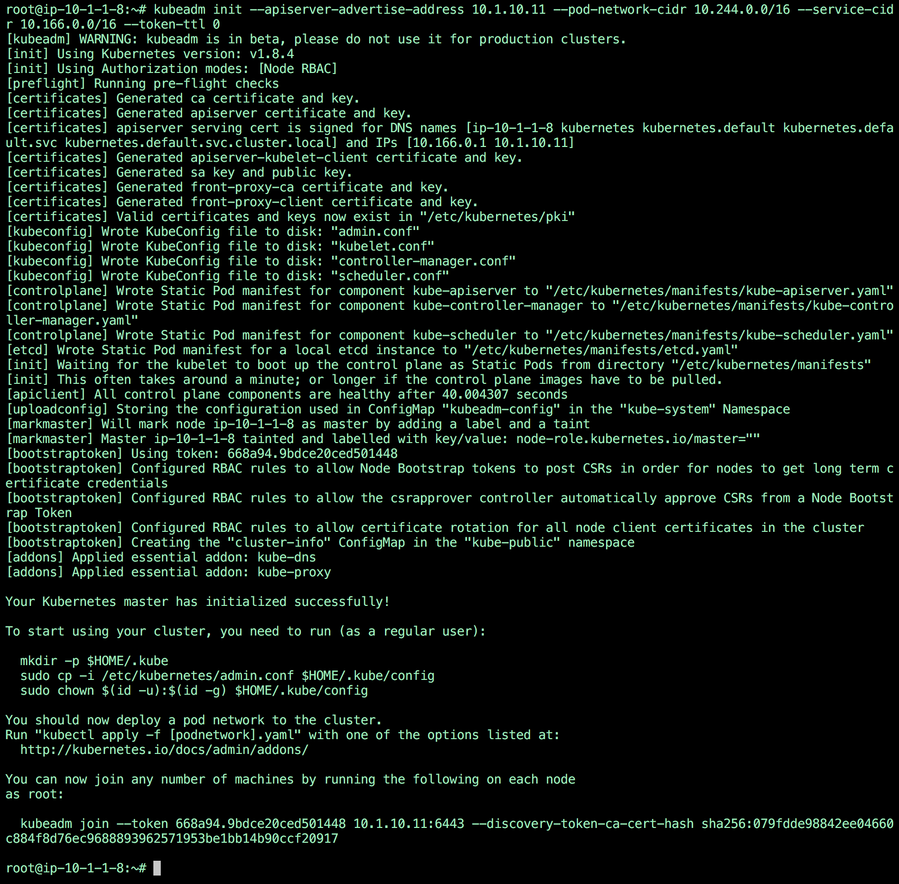
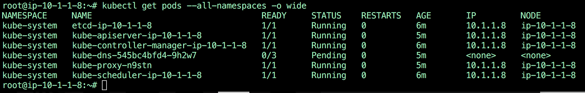
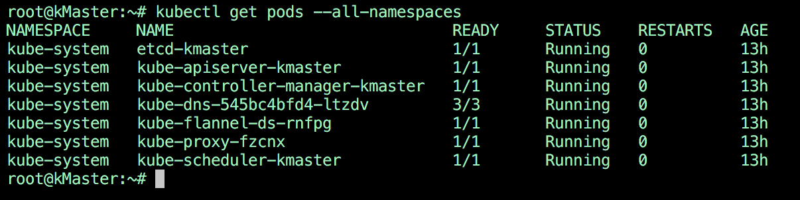
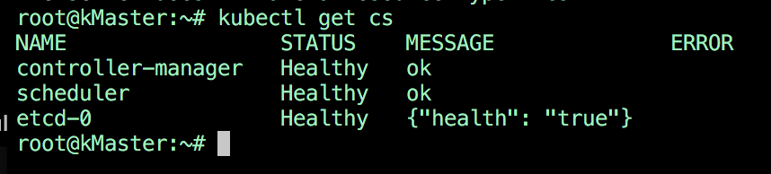
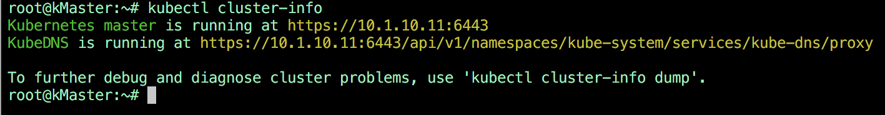

Setup master
============

Master initialization
---------------------

The master is the system where the "control plane" components run, including etcd (the cluster database) and the API server (which the kubectl CLI communicates with). All of these components run in pods started by kubelet (which is why we had to setup docker first even on the master node)

In this section, we will setup our master node on the Ubuntu server we will call **master** and we will connect to it to explore system PODs running.
It is always better to specify the server IP address where the Kubernetes Master is going to listen for API requests. We will specify the CIDR for our PODs Network and the CIDR for our SERVICEs Network; moreover, for lab purposes, we will ask for a token which will never expire.

To setup **master** as a Kubernetes *master*, run the following command:

::

        sudo kubeadm init --apiserver-advertise-address 10.1.10.11 --pod-network-cidr 10.244.0.0/16 --service-cidr 10.166.0.0/16 --token-ttl 0 --node-name [DNS node name] 

Here we specify:

* The IP address that should be used to advertise the master. 10.1.10.0/24 is the network for our control plane. if you don't specify the --api-advertise-addresses argument, kubeadm will pick the first interface with a default gateway (because it needs internet access). 
  

When running the command you should see something like this:

The initialization is successful if you see "Your Kubernetes master has initialized successfully!"

In the output of the kubeadm command you should see a line like this:

::

	sudo kubeadm join --token=62468f.9dfb3fc97a985cf9 10.1.10.11

This is the command to run on the node so that it registers itself with the master. Keep the secret safe since anyone with this token can add authenticated node to your cluster. This is used for mutual auth between the master and the nodes

.. warning::

	**save this command somewhere since you'll need it later**

To start using your clusterm you need to:

::

        mkdir -p $HOME/.kube
        sudo cp -i /etc/kubernetes/admin.conf $HOME/.kube/config
        sudo chown $(id -u):$(id -g) $HOME/.kube/config

You can monitor that the services start to run by using the command:

::

	kubectl get pods --all-namespaces -o wide

You'll see a number of PODs running plus kube-dns in pending state because it won't start until the network pod is setup.

Network pod
-----------

You must install a *pod* network add-on so that your *pods* can communicate with each other.

**It is necessary to do this before you try to deploy any applications to your cluster**, and before* kube-dns* will start up. Note also that *kubeadm* only supports CNI based networks and therefore kubenet based networks will not work.

Here is the list of add-ons available:

* Calico
* Canal
* Flannel
* Romana
* Weave net

We will use Flannel as mentioned previously. To set Flannel as a network pod, we need to first modify the flannel deployment.  First download the YAML deployment file.

::

	wget https://raw.githubusercontent.com/coreos/flannel/master/Documentation/kube-flannel.yml

Change "vxlan" to "host-gw" for Type and delete the "portmap" plugin; you shoud have a json section which reads:

::

 data:
   cni-conf.json: |
     {
       "name": "cbr0",
       "plugins": [
         {
           "type": "flannel",
           "delegate": {
             "hairpinMode": true,
             "isDefaultGateway": true
           }
         }
       ]
     }
   net-conf.json: |
     {
       "Network": "10.244.0.0/16",
       "Backend": {
         "Type": "host-gw"
       }
     }

If we are using multiple interface in Ubuntu Server, we need to specify the "--iface" argument to the flanneld command:

::

      containers:
      - name: kube-flannel
        image: quay.io/coreos/flannel:v0.9.1-amd64
        command:
        - /opt/bin/flanneld
        args:
        - --ip-masq
        - --kube-subnet-mgr
        - --iface=eth1

Now deploy flannel.

::

	kubectl apply -f ./kube-flannel.yml
	

Final checks on Kubernetes Master Server state
----------------------------------------------

If everything runs as expected you should have kube-dns that started successfully. To check the status of the different service, you can run the command:

::

	watch kubectl get pods --all-namespaces

The output should show all services as running

::

	kubectl get cs

::

	kubectl cluster-info

In AWS you may need to modify kubelet to ensure that the correct name is used by the node and that it can join correctly.  Example in /etc/systemd/system/kubelet.service.d/10-kubeadm.conf.  This attempts to workaround: https://github.com/kubernetes/kubernetes/issues/47695

::

	[Service]
	Environment="KUBELET_KUBECONFIG_ARGS=--kubeconfig=/etc/kubernetes/kubelet.conf --require-kubeconfig=true --hostname-override=ip-10-1-1-11.us-west-2.compute.internal --node-ip=10.1.10.21"
	Environment="KUBELET_SYSTEM_PODS_ARGS=--pod-manifest-path=/etc/kubernetes/manifests --allow-privileged=true"
	Environment="KUBELET_NETWORK_ARGS=--network-plugin=cni --cni-conf-dir=/etc/cni/net.d --cni-bin-dir=/opt/cni/bin"
	Environment="KUBELET_DNS_ARGS=--cluster-dns=10.96.0.10 --cluster-domain=cluster.local"
	Environment="KUBELET_AUTHZ_ARGS=--authorization-mode=Webhook --client-ca-file=/etc/kubernetes/pki/ca.crt"
	Environment="KUBELET_CADVISOR_ARGS=--cadvisor-port=0"
	Environment="KUBELET_CGROUP_ARGS=--cgroup-driver=systemd"
	ExecStart=
	ExecStart=/usr/bin/kubelet $KUBELET_KUBECONFIG_ARGS $KUBELET_SYSTEM_PODS_ARGS $KUBELET_NETWORK_ARGS $KUBELET_DNS_ARGS $KUBELET_AUTHZ_ARGS $KUBELET_CADVISOR_ARGS $KUBELET_CGROUP_ARGS $KUBELET_EXTRA_ARGS

You will also want to remove the line "- --admission-control=..." from /etc/kubernetes/manifests/kube-apiserver.yaml

The next step will be to have our *nodes* join the *master*

