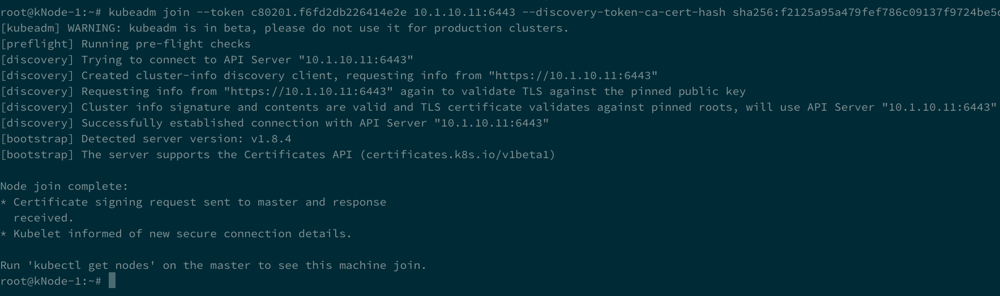
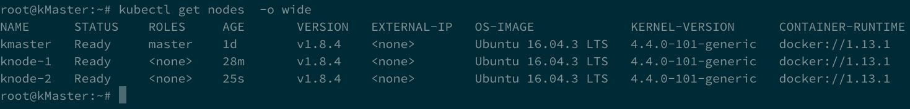
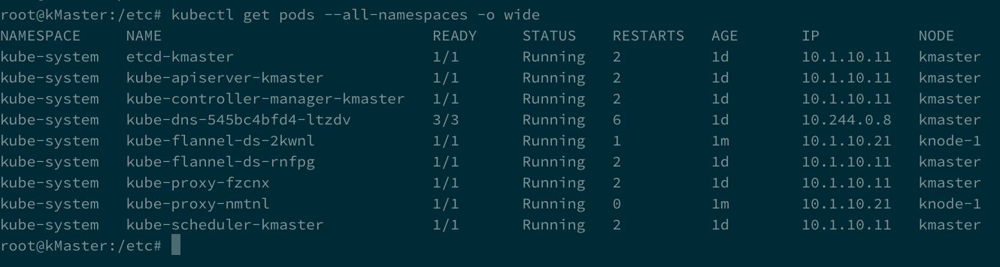

Node setup
==========

Once the master is setup and running, we need to connect our *nodes* to it. Please be sure you did all the steps reported in the cluster installation section on each node of the cluster.

Join the master
---------------

to join the master we need to run the command highlighted during the master initialization. In our setup it was:

::

	sudo kubeadm join --token=62468f.9dfb3fc97a985cf9 10.1.10.11 --node-name [DNS name]

the output should be like this :

to make sure that your *nodes* have joined, you can run this command on the *master*:

::

	 kubectl get nodes -o wide

You should see your cluster (ie *master* + *nodes*)

Check that all the services are started as expected and everything is in a stable "running" state, running this command on the **master**: 

::

	kubectl get pods --all-namespaces -o wide

In AWS you may need to modify kubelet to ensure that the correct name is used by the node and that it can join correctly.  Example in /etc/systemd/system/kubelet.service.d/10-kubeadm.conf.  This attempts to workaround: https://github.com/kubernetes/kubernetes/issues/47695

::

	[Service]
	Environment="KUBELET_KUBECONFIG_ARGS=--kubeconfig=/etc/kubernetes/kubelet.conf --require-kubeconfig=true --hostname-override=ip-10-1-1-11.us-west-2.compute.internal --node-ip=10.1.10.21"
	Environment="KUBELET_SYSTEM_PODS_ARGS=--pod-manifest-path=/etc/kubernetes/manifests --allow-privileged=true"
	Environment="KUBELET_NETWORK_ARGS=--network-plugin=cni --cni-conf-dir=/etc/cni/net.d --cni-bin-dir=/opt/cni/bin"
	Environment="KUBELET_DNS_ARGS=--cluster-dns=10.96.0.10 --cluster-domain=cluster.local"
	Environment="KUBELET_AUTHZ_ARGS=--authorization-mode=Webhook --client-ca-file=/etc/kubernetes/pki/ca.crt"
	Environment="KUBELET_CADVISOR_ARGS=--cadvisor-port=0"
	Environment="KUBELET_CGROUP_ARGS=--cgroup-driver=systemd"
	ExecStart=
	ExecStart=/usr/bin/kubelet $KUBELET_KUBECONFIG_ARGS $KUBELET_SYSTEM_PODS_ARGS $KUBELET_NETWORK_ARGS $KUBELET_DNS_ARGS $KUBELET_AUTHZ_ARGS $KUBELET_CADVISOR_ARGS $KUBELET_CGROUP_ARGS $KUBELET_EXTRA_ARGS
