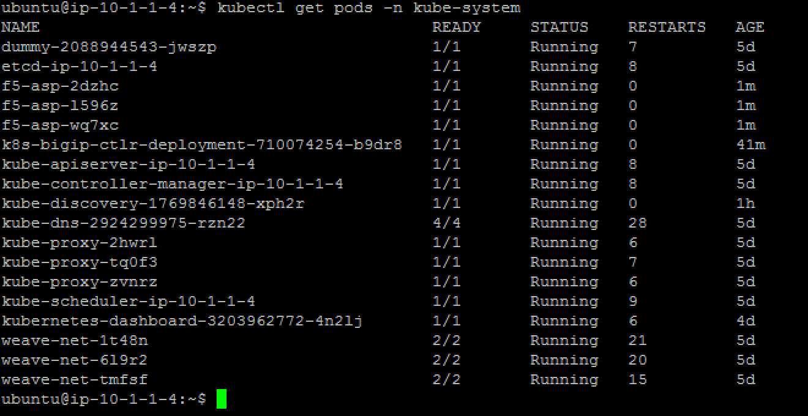
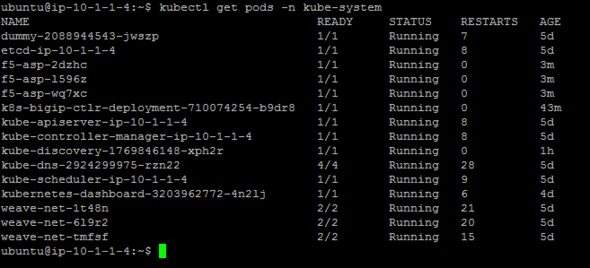
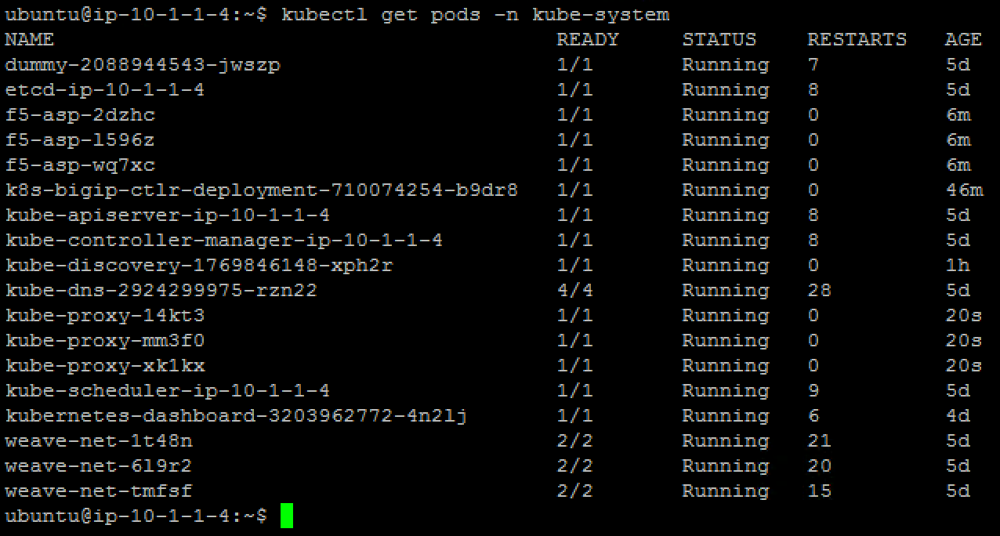

F5 ASP and kube-proxy Deployment
================================

To use ASP, we will need to add a Application Services Proxy(ASP) Instance to Every Node

Every node in the cluster need to run an instance of ASP. The steps below demonstrate how to use a Kubernetes ConfigMap and DaemonSet to run one Application Services Proxy per node and apply the same configurations to each ASP instance.

The DaemonSet ensures one Application Services Proxy runs per node in the Kubernetes cluster. The ConfigMap contains the configurations you want to apply to each ASP instance.

The first step will be to load the relevant F5 container images into our system. if you use the UDF blueprint, it's already done in our private registry (10.1.10.11:5000).  Normally you would retreive ASP from the Docker Store (requires accepting a EULA, freely distributed).

the official F5 ASP documentation is here: `Install the F5 Kubernetes Application Service Proxy <http://clouddocs.f5.com/containers/v1/kubernetes/asp-install-k8s.html>`_  and `Deploy the F5 Application Service Proxy with the F5 Kubernetes Prox <http://clouddocs.f5.com/containers/v1/kubernetes/asp-k-deploy.html>`_ 

Deploy ASP 
----------

To deploy ASP, we will need to load several configuration into our Kubernetes solution:

* A configmap: The ConfigMap contains the configurations you want to apply to each LWP instance.
* A daemonset: The DaemonSet ensures one Application Services Proxy runs per node in the Kubernetes cluster. 

To setup those components, connect to the **master** and do the following: 

create a yaml file called *f5-asp-configmap.yaml* and here is the content to copy/paste into it. 

::

	kind: ConfigMap
	apiVersion: v1
	metadata:
	  name: f5-asp-config
	  namespace: kube-system
	data:
	  asp.config.json: |-
	    {
	      "global": {
	        "console-log-level": "info"
	      },
	      "orchestration": {
	        "kubernetes": {
	          "config-file": "/var/run/kubernetes/proxy-plugin/service-ports.json",
	          "poll-interval": 500
	        }
	      }
	    }

Once the configmap file is done, we can setup the daemonset file. Create a file called *f5-asp-daemonset.yaml* and here is the content to copy/paste into it. 

::

	apiVersion: extensions/v1beta1
	kind: DaemonSet
	metadata:
	  name: f5-asp
	  namespace: kube-system
	spec:
	  template:
	    metadata:
	      labels:
	        name: f5-asp
	    spec:
	      hostNetwork: true
	      containers:
	        - name: proxy-plugin
	          image: "10.1.10.11:5000/asp:v1.0.0"
	          args:
	            - --config-file
	            - /etc/configmap/asp.config.json
	          securityContext:
	            privileged: false
	          volumeMounts:
	          - mountPath: /var/run/kubernetes/proxy-plugin
	            name: plugin-config
	            readOnly: true
	          - mountPath: /etc/configmap
	            name: asp-config
	      volumes:
	        - name: plugin-config
	          hostPath:
	            path: /var/run/kubernetes/proxy-plugin
	        - name: asp-config
	          configMap:
	            name: f5-asp-config

Once our files are created, we can use them to create the relevant ConfigMap and Daemonset to start our ASP instances. 

On the **master**, run the following commands: 

:: 

	kubectl create -f f5-asp-configmap.yaml

	kubectl create -f f5-asp-daemonset.yaml

Here the ASP should be deployed automatically. You should have as many ASP instances launched as kubernetes systems you have in your kubernetes cluster (in the UDF blueprint, it's three - 3). You can validate this with the following commands: 

::

	kubectl get pods -n kube-system

The ASP are deployed. Now we need to update the kube-proxy with the F5-kube-proxy instances so that we can leverage our ASP

Deploy f5-kube-proxy
--------------------

Right now, we have a Daemonset that is used to deploy the default kube-proxy. We will retrieve it to delete the existing instances. 

To retrieve the kube-proxy daemonset config, run the following command to review its configuration: 

::

	kubectl edit ds kube-proxy -n kube-system

It should launch a VI editor, save the configuration with the following command in vi :

::

	:w /tmp/kube-proxy-origin.yaml

Now we can create our new daemonset to launch the F5-kube-proxy. create a new deamonset yaml called *f5-kube-proxy-ds.yaml*

::

	vi  /tmp/f5-kube-proxy-ds.yaml

Here is the content of the file, copy/paste it. 

::

	# Please edit the object below. Lines beginning with a '#' will be ignored,
	# and an empty file will abort the edit. If an error occurs while saving this file will be
	# reopened with the relevant failures.
	#
	apiVersion: extensions/v1beta1
	kind: DaemonSet
	metadata:
	  creationTimestamp: null
	  generation: 1
	  labels:
		component: kube-proxy
		k8s-app: kube-proxy
		kubernetes.io/cluster-service: "true"
		name: kube-proxy
		tier: node
	  name: kube-proxy
	  selfLink: /apis/extensions/v1beta1/namespaces//daemonsets/kube-proxy
	spec:
	  selector:
		matchLabels:
		  component: kube-proxy
		  k8s-app: kube-proxy
		  kubernetes.io/cluster-service: "true"
		  name: kube-proxy
		  tier: node
	  template:
		metadata:
		  annotations:
			scheduler.alpha.kubernetes.io/affinity: '{"nodeAffinity":{"requiredDuringSchedulingIgnoredDuringExecution":{"nodeSelectorTerms":[{"matchExpressions":[{"key":"beta.kubernetes.io/arch","operator":"In","values":["amd64"]}]}]}}}'
			scheduler.alpha.kubernetes.io/tolerations: '[{"key":"dedicated","value":"master","effect":"NoSchedule"}]'
		  creationTimestamp: null
		  labels:
			component: kube-proxy
			k8s-app: kube-proxy
			kubernetes.io/cluster-service: "true"
			name: kube-proxy
			tier: node
		spec:
		  containers:
		  - command:
			- /proxy
			- --kubeconfig=/run/kubeconfig
			image: f5networks/f5-kube-proxy:1.0.0
			imagePullPolicy: IfNotPresent
			name: kube-proxy
			resources: {}
			securityContext:
			  privileged: true
			terminationMessagePath: /dev/termination-log
			volumeMounts:
			- mountPath: /var/run/dbus
			  name: dbus
			- mountPath: /run/kubeconfig
			  name: kubeconfig
			- mountPath: /var/run/kubernetes/proxy-plugin
			  name: plugin-config
			  readOnly: false
		  dnsPolicy: ClusterFirst
		  hostNetwork: true
		  restartPolicy: Always
		  securityContext: {}
		  terminationGracePeriodSeconds: 30
		  volumes:
		  - hostPath:
			  path: /etc/kubernetes/kubelet.conf
			name: kubeconfig
		  - hostPath:
			  path: /var/run/dbus
			name: dbus
		  - name: plugin-config
			hostPath:
			  path: /var/run/kubernetes/proxy-plugin
	status:
	  currentNumberScheduled: 0
	  desiredNumberScheduled: 0
	  numberMisscheduled: 0
	  numberReady: 0

Now that we have the legacy ds config and the updated one, we can delete the existing kube-proxy ds with the following command:

:: 

	kubectl delete -f /tmp/kube-proxy-origin.yaml

You can check that the kube-proxy instances have been removed from Kubernetes with the following command

::

	kubectl get pods -n kube-system

We can deploy the updated daemonset: 

::

	kubectl create -f /tmp/f5-kube-proxy-ds.yaml
 
You can check that the deployment was successful with the command: 

::

	kubectl get pods -n kube-system

