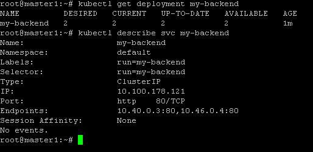
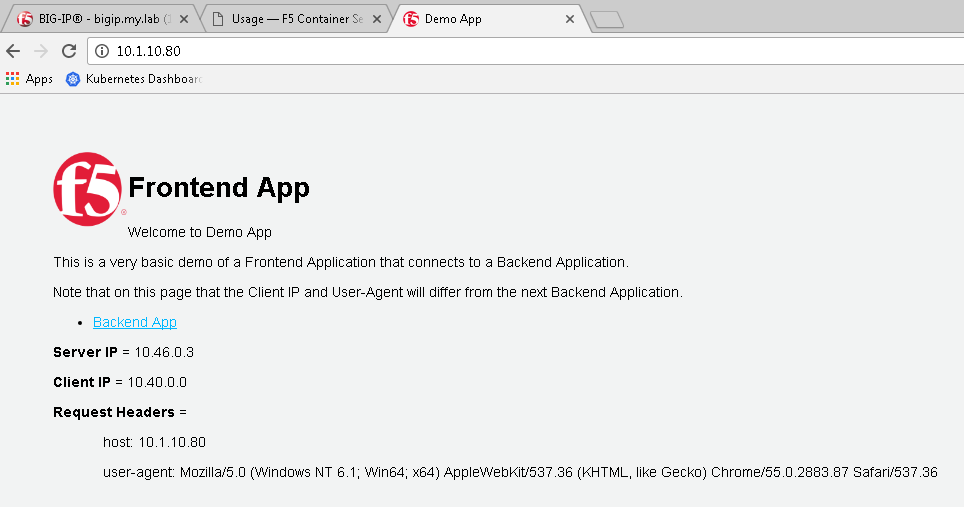
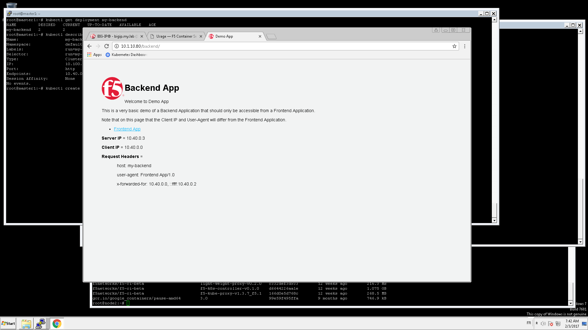

Test ASP and F5 Kube Proxy
==========================

The F5 ASP instances and F5 kube proxy instances have been deployed. Now we need to test our setup. To do so we will setup a backend application that will be reached by the frontend application we created earlier. 

To deploy the backend application, connect to the **master**

We need to create two configuration to deploy our backend application:

* The deployment: it will define the application to deploy
* The service: will define our access our application. It will also contains annotations to leverage the ASP Lightweight proxy

Create a file called *my-backend-deployment.yaml*. Here is its content: 

::

  apiVersion: extensions/v1beta1
  kind: Deployment
  metadata:
    name: my-backend
  spec:
    replicas: 2
    template:
      metadata:
        labels:
         run: my-backend
      spec:
        containers:
        - image: 10.1.10.11:5000/f5-demo-app
          imagePullPolicy: IfNotPresent
          env:
          - name: F5DEMO_APP
            value: "backend"
          name: my-backend
          ports:
          - containerPort: 80
            protocol: TCP

Create another file called *my-backend-service.yaml*. Here is its content: 

::

  apiVersion: v1
  kind: Service
  metadata:
    annotations:
      asp.f5.com/config: |
         {
            "ip-protocol": "http",
           "load-balancing-mode": "round-robin",
           "flags" : {
             "x-forwarded-for": true,
             "x-served-by": true
           }
         }
    name: my-backend
    labels:
      run: my-backend
  spec:
    ports:
    - name: "http"
      port: 80
      protocol: TCP
      targetPort: 80
    selector:
      run: my-backend

Once our files are created, we can deploy our backend application with the following commands: 

::

  kubectl create -f my-backend-deployment.yaml

  kubectl create -f my-backend-service.yaml

You can check if the deployment was successful with the commands: 

::

  kubectl get deployment my-backend

  kubectl describe svc my-backend

To test our application, access the frontend app with your browser. It is available via the BIG-IP with the URL: http://10.1.10.80

click on "Backend App". Here you should see that the client is frontend app and not your browser anymore. It is because we did Client -> Frontend App -> Backend App

