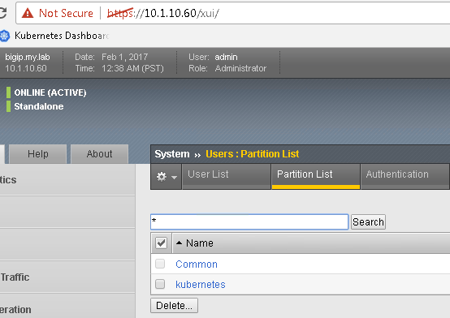
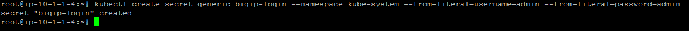
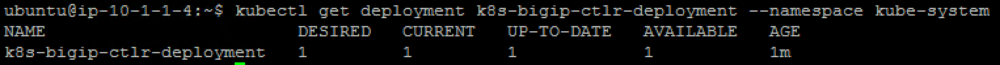
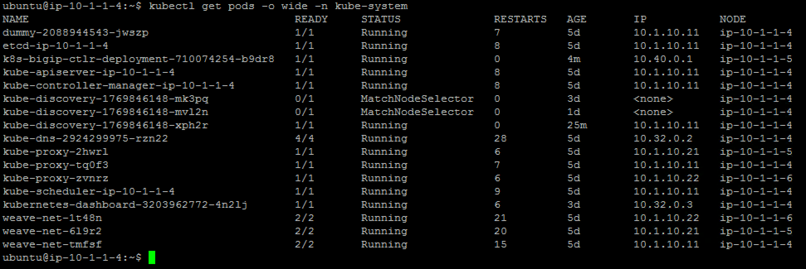
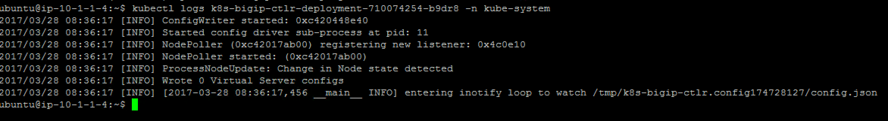
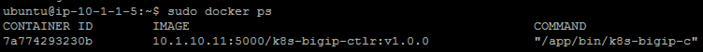
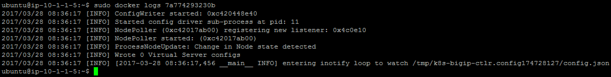

Container Connector(CC) Setup
=============================

the official CC documentation is here: `Install the F5 Kubernetes BIG-IP Controller <http://clouddocs.f5.com/containers/v1/kubernetes/kctlr-app-install.html>`_

BIG-IP setup
------------

To use F5 Container connector, you'll need a BIG-IP up and running first. 

In the UDF blueprint, you should have a BIG-IP available at the following URL: https://10.1.10.60

.. warning:: 

	if you use UDF, it's recommended to connect to your BIG-IP from the RDP session instead of going directly to it from the UDF portal and TMUI option

Connect to your BIG-IP and check it is active and licensed. Its login and password are: **admin/admin**

.. note::

	if your BIG-IP has no license or its license expired, renew the license. You just need a LTM VE license for this lab. No specific add-ons are required

You need to setup a partition that will be used by F5 Container Connector. 

To do so go to : System > Users > Partition List. Create a new partition called "kubernetes"

Once your partition is created, we can go back to Kubernetes to setup the F5 Container connector

Container Connector deployment
------------------------------

Here we consider you have already retrieved the F5 container connector image and loaded it in the environment. 

Now that our container is loaded, we need to define a deployment: `Kubernetes deployments <https://kubernetes.io/docs/user-guide/deployments/>`_ and create a secret to hide our bigip credentials. `Kubernetes secrets <https://kubernetes.io/docs/user-guide/secrets/>`_

On the **master** , we need to setup a deployment file to load our container and also setup a secret for our big-ip credentials

.. note:: 

	You can access it by running PUTTY in the RDP session, a session is already setup there

	.. image:: ../images/f5-container-connector-launch-ssh.png
		:align: center
		:scale: 50%

You will need to create a serviceaccount for the controller to be able to access the Kubernetes API when RBAC is enabled in Kubernetes.  To create a serviceaccount run:

::

    kubectl create serviceaccount bigip-ctlr -n kube-system

You will also need to apply an RBAC policy.  create a file called f5-k8s-sample-rbac.yaml

.. code-block:: yaml

    # for use in k8s clusters using RBAC
    kind: ClusterRole
    apiVersion: rbac.authorization.k8s.io/v1beta1
    metadata:
      name: bigip-ctlr-clusterrole
    rules:
    - apiGroups:
      - ""
      - "extensions"
      resources:
      - nodes
      - services
      - endpoints
      - namespaces
      - ingresses
      - secrets
      verbs:
      - get
      - list
      - watch
    - apiGroups:
      - ""
      - "extensions"
      resources:
      - configmaps
      - events
      - ingresses/status
      verbs:
      - get
      - list
      - watch
      - update
      - create
      - patch
    
    ---
    
    kind: ClusterRoleBinding
    apiVersion: rbac.authorization.k8s.io/v1beta1
    metadata:
      name: bigip-ctlr-clusterrole-binding
      namespace: kube-system
    roleRef:
      apiGroup: rbac.authorization.k8s.io
      kind: ClusterRole
      name: bigip-ctlr-clusterrole
    subjects:
    - kind: ServiceAccount
      name: bigip-ctlr
      namespace: kube-system
    

To apply the RBAC policy run

::

	kubectl create -f f5-k8s-sample-rbac.yaml

To setup the secret containing your BIG-IP login and password, you can run the following command:

::

	kubectl create secret generic bigip-login --namespace kube-system --from-literal=username=admin --from-literal=password=admin

you should see something like this: 

create a file called f5-cc-deployment.yaml. Here is its content:

::

    apiVersion: extensions/v1beta1
    kind: Deployment
    metadata:
      name: k8s-bigip-ctlr-deployment
      namespace: kube-system
    spec:
      replicas: 1
      template:
        metadata:
          name: k8s-bigip-ctlr
          labels:
            app: k8s-bigip-ctlr
        spec:
          serviceAccountName: bigip-ctlr
          containers:
            - name: k8s-bigip-ctlr
              # replace the version as needed
              image: "f5networks/k8s-bigip-ctlr:1.3.0"
              env:
                - name: BIGIP_USERNAME
                  valueFrom:
                    secretKeyRef:
                      name: bigip-login
                      key: username
                - name: BIGIP_PASSWORD
                  valueFrom:
                    secretKeyRef:
                      name: bigip-login
                      key: password
              command: ["/app/bin/k8s-bigip-ctlr"]
              args: [
                "--bigip-username=$(BIGIP_USERNAME)",
                "--bigip-password=$(BIGIP_PASSWORD)",
                "--bigip-url=10.1.10.60",
                "--bigip-partition=kubernetes",
                # The Controller can use local DNS to resolve hostnames;
                # defaults to LOOKUP; can be replaced with custom DNS server IP
                # or left blank (introduced in v1.3.0)
                "--resolve-ingress-names=LOOKUP"
                # The Controller can access Secrets by default;
                # set to "false" if you only want to use preconfigured
                # BIG-IP SSL profiles
                #"--use-secrets=false",
                # The Controller watches all namespaces by default.
                # To manage a single namespace, or multiple namespaces, provide a
                # single entry for each. For example:
                # "--namespace=test",
                # "--namespace=prod"
                ]
          imagePullSecrets:
            - name: f5-docker-images
            - name: bigip-login

.. Note::

	If you use UDF, you have templates you can use in your jumpbox. It's on the Desktop > F5 > kubernetes-demo folder. If you use those files, you'll need to :

		* check the container image path in the deployment file is accurate
		* Update the "bindAddr" in the configMap for an IP you want to use in this blueprint. 

if you don't use the UDF blueprint, you need to update the field *image* with the appropriate path to your image. 

If you have issues with your yaml and syntax (**identation MATTERS**), you can try to use an online parser to help you : `Yaml parser <http://codebeautify.org/yaml-validator>`_

Once you have your yaml file setup, you can try to launch your deployment. It will start our f5-k8s-controller container on one of our node (may take around 30sec to be in a running state): 

::

	kubectl create -f f5-cc-deployment.yaml

	kubectl get deployment k8s-bigip-ctlr-deployment --namespace kube-system

FYI, To locate on which node the container connector is running, you can use the following command: 

:: 

	kubectl get pods -o wide -n kube-system

We can see that our container is running on ip-10-1-1-5 (Agent1) 

If you need to troubleshoot your container, you have two different ways to check the logs of your container: 

	1. via kubectl command (recommended - easier)
	2. by connecting to the relevant node and use docker command. Here you'll need to identify on which node it runs and use docker logs command: 

If you want to use kubectl command: you need to use the full name of your pod as showed in the previous image and run the command kubectl logs k8s-bigip-ctlr-deployment-<id> -n kube-system

::

	 kubectl logs k8s-bigip-ctlr-deployment-710074254-b9dr8 -n kube-system

If you want to use docker logs command

On **ip-10-1-1-5** which is Node1 (or another node depending on the previous command): 

:: 

	sudo docker ps 

Here we can see our container ID: 7a774293230b 

Now we can check our container logs: 

:: 

	sudo docker logs 7a774293230b 

You can connect to your container with kubectl also: 

.. code-block:: shell

	 kubectl exec -it k8s-bigip-ctlr-deployment-710074254-b9dr8 -n kube-system  -- /bin/sh

	 cd /app

	 ls -lR

	 exit
