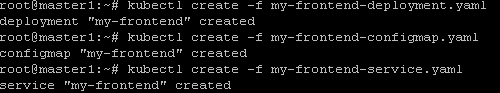
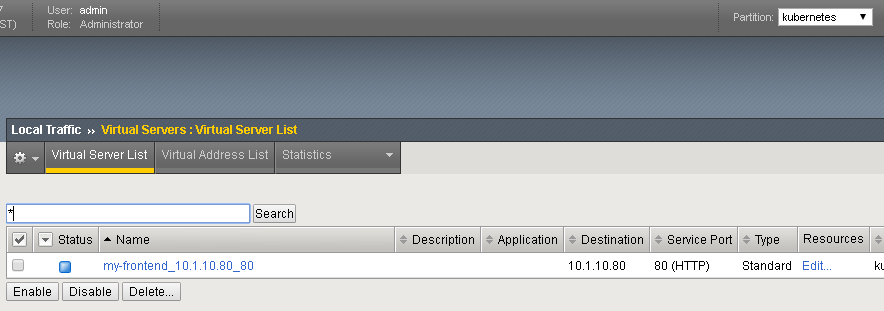
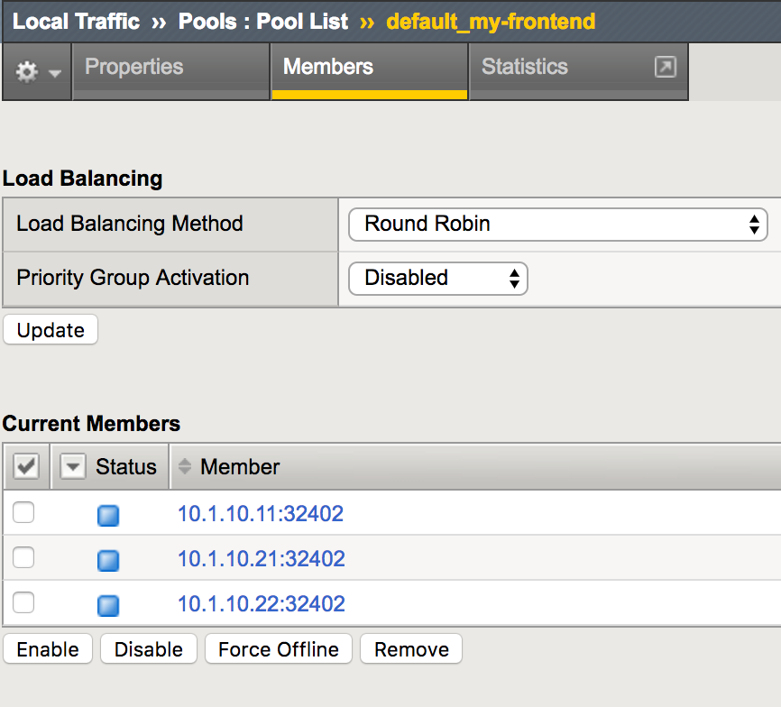
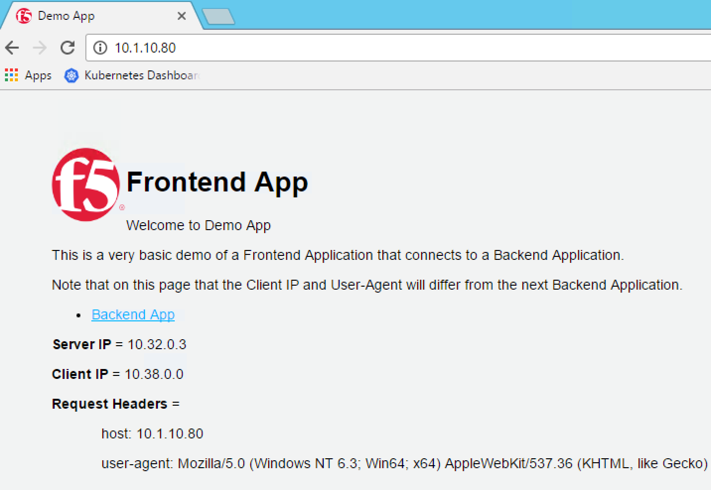

Container Connector Usage
=========================

Now that our container connector is up and running, let's deploy an application and leverage our CC. 

if you don't use UDF, you can deploy any application you want. In UDF, the blueprint already has a container called f5-demo-app already loaded as an image (Application provided by Eric Chen - F5 Cloud SA). It is loaded in Docker Hub chen23/f5-demo-app

To deploy our front-end application, we will need to do the following:

#. Define a deployment: this will launch our application running in a container
#. Define a ConfigMap: ConfigMap can be used to store fine-grained information like individual properties or coarse-grained information like entire config files or JSON blobs. It will contain the BIG-IP configuration we need to push
#. Define a Service: A Kubernetes *service* is an abstraction which defines a logical set of *pods* and a policy by which to access them. expose the *service* on a port on each node of the cluster (the same port on each *node*). You’ll be able to contact the service on any <NodeIP>:NodePort address. If you set the type field to "NodePort", the Kubernetes master will allocate a port from a flag-configured range **(default: 30000-32767)**, and each Node will proxy that port (the same port number on every Node) into your *Service*. 

App Deployment
--------------

On the **master** we will create all the required files: 

Create a file called my-frontend-deployment.yaml: 

::

	apiVersion: extensions/v1beta1
	kind: Deployment
	metadata:
	  name: my-frontend
	spec:
	  replicas: 2
	  template:
	    metadata:
	      labels:
	        run: my-frontend
	    spec:
	      containers:
	      - image: "chen23/f5-demo-app"
	        env:
	        - name: F5DEMO_APP
	          value: "frontend"
	        - name: F5DEMO_BACKEND_URL
	          value: "http://my-backend/"
	        imagePullPolicy: IfNotPresent
	        name: my-frontend
	        ports:
	        - containerPort: 80
	          protocol: TCP

Create a file called my-frontend-configmap.yaml:

::

	kind: ConfigMap
	apiVersion: v1
	metadata:
	  name: my-frontend
	  namespace: default
	  labels:
	    f5type: virtual-server
	data:
	  schema: "f5schemadb://bigip-virtual-server_v0.1.3.json"
	  data: |-
	    {
	      "virtualServer": {
	        "frontend": {
	          "balance": "round-robin",
	          "mode": "http",
	          "partition": "kubernetes",
	          "virtualAddress": {
	            "bindAddr": "10.1.10.80",
	            "port": 80
	          }
	        },
	        "backend": {
	          "serviceName": "my-frontend",
	          "servicePort": 80
	        }
	      }
	    }

Create a file called my-frontend-service.yaml:

::

	apiVersion: v1
	kind: Service
	metadata:
	  name: my-frontend
	  labels:
	    run: my-frontend
	spec:
	  ports:
	  - port: 80
	    protocol: TCP
	    targetPort: 80
	  type: NodePort
	  selector:
	    run: my-frontend

.. Note::

	If you use UDF, you have templates you can use in your jumpbox. It's on the Desktop > F5 > kubernetes-demo folder. If you use those files, you'll need to :
	* check the container image path in the deployment file is accurate
	* Update the "bindAddr" in the configMap for an IP you want to use in this blueprint. 

We can now launch our application : 

::

	kubectl create -f my-frontend-deployment.yaml

	kubectl create -f my-frontend-configmap.yaml

	kubectl create -f my-frontend-service.yaml

to check the status of our deployment, you can run the following commands: 

::

	kubectl get pods -n default 

	kubectl describe svc -n default

.. image:: ../images/f5-container-connector-check-app-definition.png
	:align: center
	:scale: 50%

Here you need to pay attention to:

	* the NodePort value. That is the port used by Kubernetes to give you access to the app from the outside. Here it's 32402
	* the endpoints. That's our 2 instances (defined as replicas in our deployment file) and the port assigned to the service: port 80

Now that we have deployed our application sucessfully, we can check our BIG-IP configuration. 

.. warning::

	Don't forget to select the "kubernetes" partition or you'll see nothing

Here you can see that the pool members listed are all the kubernetes nodes. 

Now you can try to access your application via your BIG-IP VIP: 10.1.10.80: 

Hit Refresh many times and go to your **BIG-IP** UI, go to Local Traffic > Pools > Pool list > my-frontend_10.1.10.80_80 > Statistics to see that traffic is distributed as expected
  
 .. image:: ../images/f5-container-connector-check-app-bigip-stats.png
 	:align: center
 	:scale: 50%

 How does traffic is forwarded in Kubernetes from the <node IP>:32402 to the <container IP>:80 ? This is done via iptables that is managed via the kube-proxy instances:

 On **any nodes** (master/nodes), run the following command: 

 :: 

 	 sudo iptables-save | grep my-frontend

 This will list you the different iptables rules that were created regarding our frontend service. 

 .. image:: ../images/f5-container-connector-list-frontend-iptables.png
 	:align: center
 	:scale: 50%

Ingress Resources
-----------------

The Container Connector also supports Kubernetes Ingress Resources as of version 1.1.0 of the F5 Container Connector.

Ingress Resources provides L7 path/hostname routing of HTTP requests.

On the master we will create a file called "node-blue.yaml".

::
    
	apiVersion: extensions/v1beta1
	kind: Deployment
	metadata:
	  name: node-blue
	spec:
	  replicas: 1
	  template:
		metadata:
		  labels:
			run: node-blue
		spec:
		  containers:
		  - image: "chen23/f5-demo-app"
			env:
			- name: F5DEMO_APP
			  value: "website"
			- name: F5DEMO_NODENAME
			  value: "Node Blue"
			- name: F5DEMO_COLOR
			  value: 0000FF
			imagePullPolicy: IfNotPresent
			name: node-blue
			ports:
			- containerPort: 80
			  protocol: TCP
	
	
	---
	apiVersion: v1
	kind: Service
	metadata:
	  name: node-blue
	  labels:
		run: node-blue
	spec:
	  ports:
	  - port: 80
		protocol: TCP
		targetPort: 80
	  type: NodePort
	  selector:
		run: node-blue 

and another file "node-green.yaml".

::
    
	apiVersion: extensions/v1beta1
	kind: Deployment
	metadata:
	  name: node-green
	spec:
	  replicas: 1
	  template:
		metadata:
		  labels:
			run: node-green
		spec:
		  containers:
		  - image: "chen23/f5-demo-app"
			env:
			- name: F5DEMO_APP
			  value: "website"
			- name: F5DEMO_NODENAME
			  value: "Node Green"
			- name: F5DEMO_COLOR
			  value: 00FF00
			imagePullPolicy: IfNotPresent
			name: node-green
			ports:
			- containerPort: 80
			  protocol: TCP
	
	---
	apiVersion: v1
	kind: Service
	metadata:
	  name: node-green
	  labels:
		run: node-green
	spec:
	  ports:
	  - port: 80
		protocol: TCP
		targetPort: 80
	  type: NodePort
	  selector:
		run: node-green

These will represent two resources that we want to place behind a single F5 Virtual Server.

Next we will create a file "blue-green-ingress.yaml".

::
    
	apiVersion: extensions/v1beta1
	kind: Ingress
	metadata:
	  name: blue-green-ingress
	  annotations:
		virtual-server.f5.com/ip: "10.1.10.82"
		virtual-server.f5.com/http-port: "80"
		virtual-server.f5.com/partition: "kubernetes"
		virtual-server.f5.com/health: |
		  [
			{
			  "path":     "blue.f5demo.com/",
			  "send":     "HTTP GET /",
			  "interval": 5,
			  "timeout":  15
			}, {
			  "path":     "green.f5demo.com/",
			  "send":     "HTTP GET /",
			  "interval": 5,
			  "timeout":  15
			}
		  ]
		kubernetes.io/ingress.class: "f5"
	spec:
	  rules:
	  - host: blue.f5demo.com
		http:
		  paths:
		  - backend:
			  serviceName: node-blue
			  servicePort: 80
	  - host: green.f5demo.com
		http:
		  paths:
		  - backend:
			  serviceName: node-green
			  servicePort: 80

We can now deploy our ingress resources.

::
  
  kubectl create -f node-blue.yaml
  kubectl create -f node-green.yaml
  kubectl create -f blue-green-ingress.yaml

