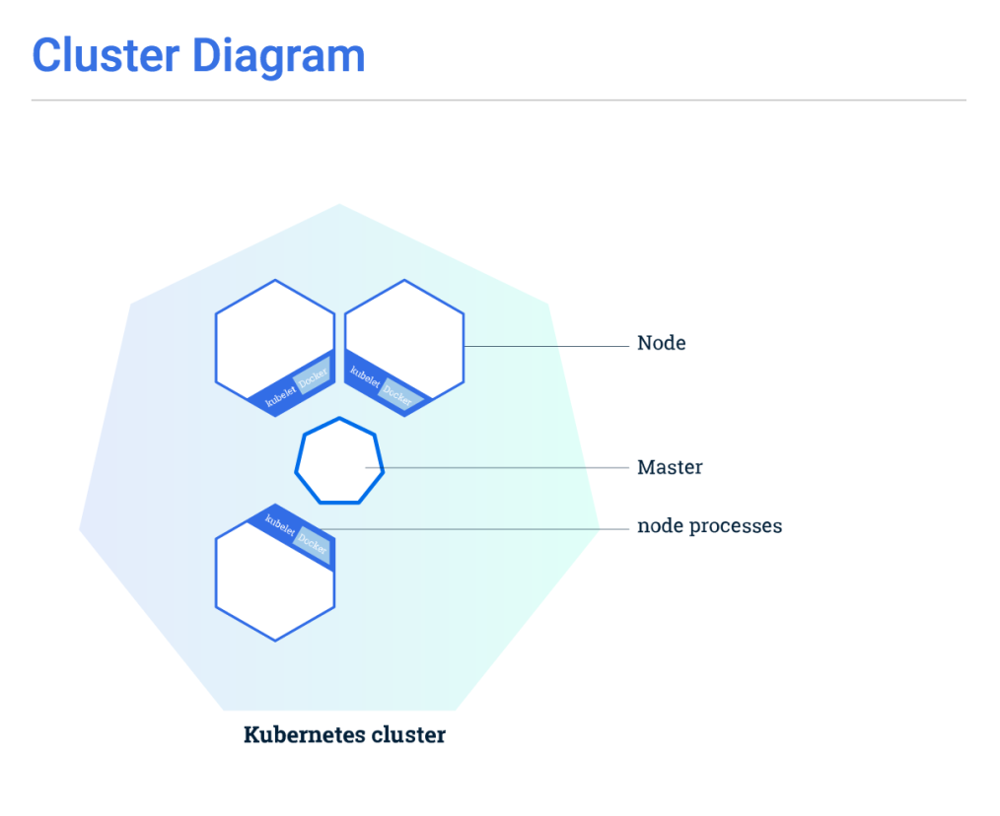

Kubernetes overview
===================

Kubernetes has a lot of documentation available at this location: `Kubernetes docs <http://kubernetes.io/docs/>`_ 

On this page, we will try to provide all the relevant information to deploy successfully a cluster (Master + nodes)

Overview
--------

Extract from: `Kubernetes Cluster intro <http://kubernetes.io/docs/tutorials/kubernetes-basics/cluster-intro/>`_

Kubernetes coordinates a highly available cluster of computers that are connected to work as a single unit. 
The abstractions in Kubernetes allow you to deploy containerized applications to a cluster without tying them specifically to individual machines. To make use of this new model of deployment, applications need to be packaged in a way that decouples them from individual hosts: they need to be containerized. 

Containerized applications are more flexible and available than in past deployment models, where applications were installed directly onto specific machines as packages deeply integrated into the host. Kubernetes automates the distribution and scheduling of application containers across a cluster in a more efficient way. Kubernetes is an open-sourceplatform and is production-ready.

A Kubernetes cluster consists of two types of resources:

* The *Master* coordinates the cluster
* *Nodes* are the workers that run applications

**The Master is responsible for managing the cluster**. The master coordinates all activity in your cluster, such as scheduling applications, maintaining applications' desired state, scaling applications, and rolling out new updates.

**A node is a VM or a physical computer that serves as a worker machine in a Kubernetes cluster**. Each *node* has a *Kubelet*, which is an agent for managing the node and communicating with the Kubernetes master. The node should also have tools for handling container operations, such as Docker or rkt. A Kubernetes cluster that handles production traffic should have a minimum of three nodes.

*Masters* manage the cluster and the *nodes* are used to host the running applications.

When you deploy applications on Kubernetes, you tell the *master* to start the application containers. The *master* schedules the containers to run on the cluster's nodes. **The nodes communicate with the master using the Kubernetes API**, which the *master* exposes. End users can also use the Kubernetes API directly to interact with the cluster.

Kubernetes concepts
-------------------

Extract from `Kubernetes concepts <http://kubernetes.io/docs/user-guide/>`_ 

**Cluster**: `Kubernetes Cluster <https://kubernetes.io/docs/admin/>`_ A cluster is a set of physical or virtual machines and other infrastructure resources used by Kubernetes to run your applications.

**Namespace**: `Kubernetes Namespace <https://kubernetes.io/docs/user-guide/namespaces/>`_ Kubernetes supports multiple virtual clusters backed by the same physical cluster. These virtual clusters are called namespaces. Namespaces are intended for use in environments with many users spread across multiple teams, or projects. For clusters with a few to tens of users, you should not need to create or think about namespaces at all. Start using namespaces when you need the features they provide.
Namespaces provide a scope for names. Names of resources need to be unique within a namespace, but not across namespaces.
Namespaces are a way to divide cluster resources between multiple uses

**Node**: `Kubernetes Node <https://kubernetes.io/docs/admin/node/>`_ A node is a physical or virtual machine running Kubernetes, onto which *pods* can be scheduled. It was previously known as *Minion*

**Pod**: `Kubernetes Pods <https://kubernetes.io/docs/user-guide/pods/>`_ A pod is a co-located group of containers and volumes. The applications in a *pod* all use the same network namespace (same IP and port space), and can thus *find* each other and communicate using **localhost**. Because of this, applications in a pod must coordinate their usage of ports. Each *pod* has an IP address in a flat shared networking space that has full communication with other physical computers and pods across the network.
In addition to defining the application containers that run in the *pod*, the *pod* specifies a set of shared storage volumes. Volumes enable data to survive container restarts and to be shared among the applications within the pod.

**Label**: `Kubernetes Label and Selector <https://kubernetes.io/docs/user-guide/labels/>`_ A label is a key/value pair that is attached to a resource, such as a *pod*, to convey a user-defined identifying attribute. Labels can be used to organize and to select subsets of resources.

**Selector**: `Kubernetes Label and Selector <https://kubernetes.io/docs/user-guide/labels/>`_ A selector is an expression that matches labels in order to identify related resources, such as which *pods* are targeted by a load-balanced service.

**deployments**:  `Kubernetes deployments <https://kubernetes.io/docs/user-guide/deployments/>`_ A Deployment provides declarative updates for Pods and Replica Sets (the next-generation Replication Controller). You only need to describe the desired state in a Deployment object, and the Deployment controller will change the actual state to the desired state at a controlled rate for you. You can define Deployments to create new resources, or replace existing ones by new ones.
A typical use case is:

* Create a Deployment to bring up a Replica Set and Pods.
* Check the status of a Deployment to see if it succeeds or not.
* Later, update that Deployment to recreate the Pods (for example, to use a new image).
* Rollback to an earlier Deployment revision if the current Deployment isn’t stable.
* Pause and resume a Deployment

**ConfigMap**: `Kubernetes ConfigMap <https://kubernetes.io/docs/user-guide/configmap/>`_ Any applications require configuration via some combination of config files, command line arguments, and environment variables. These configuration artifacts should be decoupled from image content in order to keep containerized applications portable. The ConfigMap API resource provides mechanisms to inject containers with configuration data while keeping containers agnostic of Kubernetes. ConfigMap can be used to store fine-grained information like individual properties or coarse-grained information like entire config files or JSON blobs

**Replication Controller**: `Kubernetes replication controller <https://kubernetes.io/docs/user-guide/replication-controller/>`_ A replication controller ensures that a specified number of *pod* replicas are running at any one time. It both allows for easy scaling of replicated systems and handles re-creation of a *pod* when the machine it is on reboots or otherwise fails.

**Service**: `Kubernetes Services <https://kubernetes.io/docs/user-guide/services/>`_ A service defines a set of *pods* and a means by which to access them, such as single stable IP address and corresponding DNS name. 
Kubernetes *pods* are mortal. They are born and they die, and they are **not resurrected**. Replication Controllers in particular create and destroy *pods* dynamically (e.g. when scaling up or down or when doing rolling updates). While each *pod* gets its own IP address, even those IP addresses cannot be relied upon to be stable over time. This leads to a problem: if some set of *pods* (let’s call them backends) provides functionality to other *pods* (let’s call them frontends) inside the Kubernetes cluster, how do those frontends find out and keep track of which backends are in that set? Enter Services.

A Kubernetes *service* is an abstraction which defines a logical set of *pods* and a policy by which to access them - sometimes called a micro-service. The set of *pods* targeted by a *service* is (usually) determined by a *label selector* 

**Volume**: `Kuebernetes volume <https://kubernetes.io/docs/user-guide/volumes/>`_ A volume is a directory, possibly with some data in it, which is accessible to a Container as part of its filesystem. Kubernetes volumes build upon Docker Volumes, adding provisioning of the volume directory and/or device.

