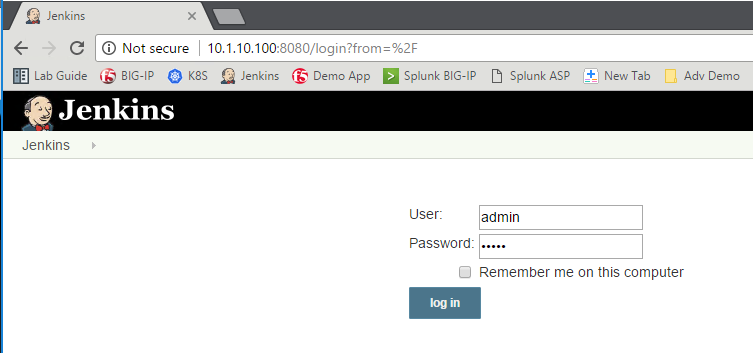
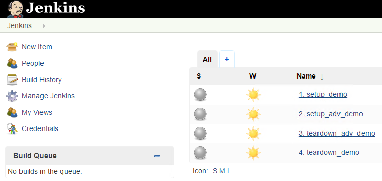
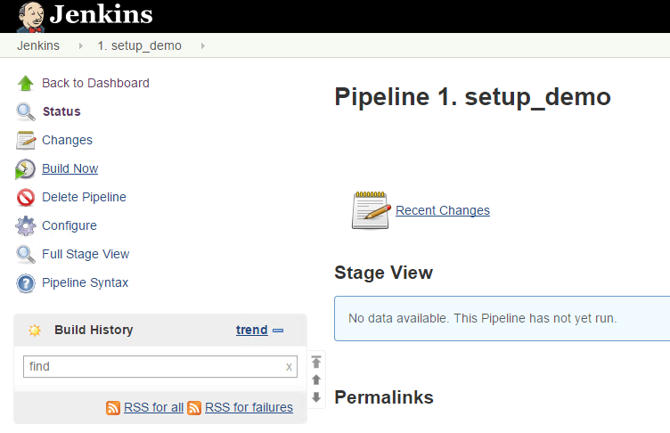
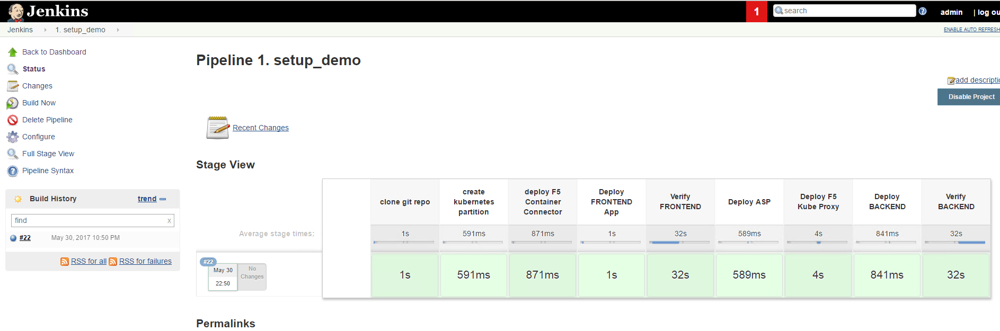

Automated F5 solutions deployment via CLI
=========================================

This is only available for users having access to F5 UDF. You need to use the blueprint called *F5 BIG-IP Controller for Kubernetes*

You may just need to have access to a kubernetes environment with F5 solutions already deployed on top of it (customer demo, troubleshooting, testing). 

If this is the case, you can just leverage a script to automatically deploy everything mentioned in the later sections:

* F5 container connector
* F5 ASP and kube-proxy

Here is how to use the script: 

#. Connect to the Splunk node (Either from UDF interface and SSH or from the Jumpbox/PUTTY) as user ubuntu
#. Go to f5-demo (/home/ubuntu/f5-demo)
#. Execute the script setup_demo.sh

::

	./setup_demo.sh

This will do the following: 

	1. Deploy F5 BIGIP-IP Controller
	2. Deploy a Frontend Application that will use our BIG-IP (BIG-IP VS will be 10.1.10.80)
	3. Deploy F5 ASP
	4. Replace Kube proxy with the F5 Kube Proxy
	5. Deploy a Backend Application that is accessible from the frontend (you have a backend link on the frontend app webpage)

Once the script is done you may need to wait a bit for all the containers to be up and running. This is something you can monitor with the command:

::

	kubectl get pods --all-namespaces

Once all the containers are in a running state, you can try to access the Frontend application through the BIG-IP on http://10.1.10.80 (you'll need to do this from the JumpBox). 

.. Note::

	* Sometimes a kube discovery service may be in an error state. It shouldn't create any issue in the lab
	* If you access the BIG-IP to check its configuration, the setup is done in the *kubernetes* partition 

Automated F5 solutions deployment via Jenkins
=============================================

This is only available for users having access to F5 UDF. You need to use the blueprint called *F5 BIG-IP Controller for Kubernetes*

You may just need to have access to a kubernetes environment with F5 solutions already deployed on top of it (customer demo, troubleshooting, testing). 

The following will perform the same steps as the previous CLI example, but use Jenkins as the tool to launch the script.

From Google Chrome click on the Jenkins bookmark and login with username: admin, password: admin

Click on the "1. setup_demo" item.

Click on "Build now"

You should see.

