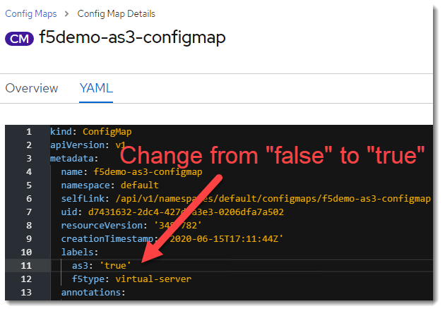
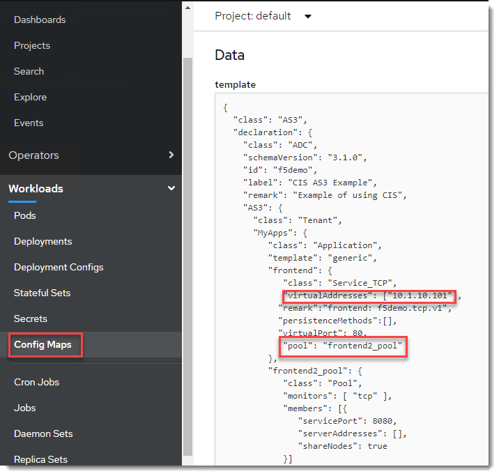
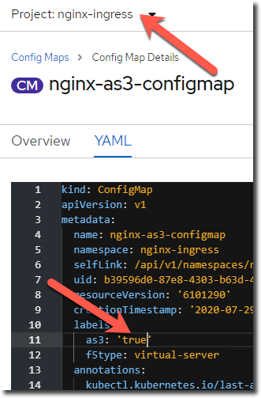
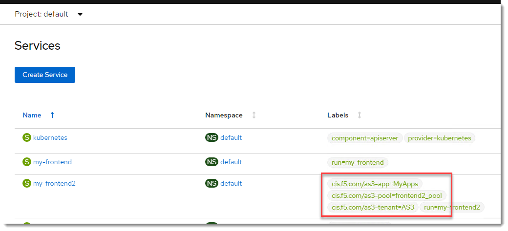
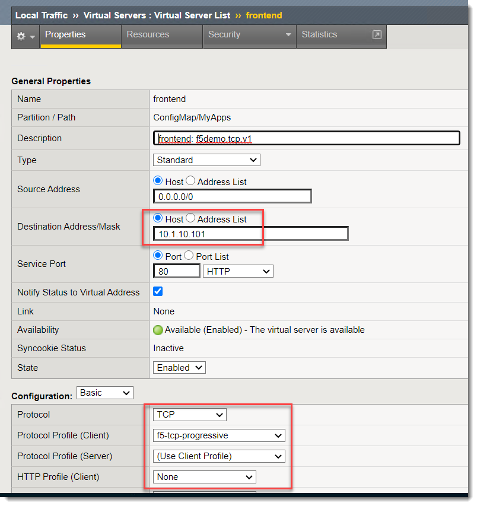
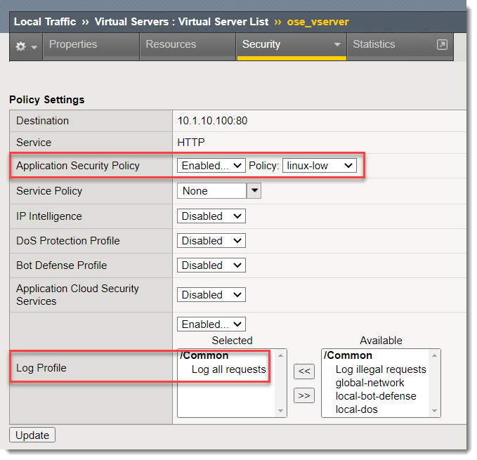

ConfigMap
=========

Introduction
~~~~~~~~~~~~

Container Ingress Services can also use a "ConfigMap" object to configure an individual BIG-IP Virtual Server.

This can be useful if you have precise requirements for how to configure the BIG-IP.  The configuration is done 
by making use of Application Services Extension 3 (AS3) to model the BIG-IP configuration in a JSON document.

Demo
~~~~

Under "Workload -> ConfigMap" click on the "f5demo-as3-configmap" object.

You will need to click on "YAML" and change the value of `as3: "false"` to `as3: "false"`.

This is to prevent IP conflicts when demo environment is spun-up (when the deployment is restarted all the 
pod IP addresses change).

.. warning:: New step added after updating to CIS 2.1.0.  Demo video does not include this step.

You will have to repeat this same step in the "nginx-ingress" namespace to modify the "nginx-as3-configmap" object.

Observe the IP address and the pool that is being used.

Next go to "Networking -> Services"

Take note of the "cis.f5.com" labels that are applied to the `my-frontend2` service.

These are used as breadcrumbs for Container Ingress Services of how to map a OpenShift service
to a BIG-IP pool.

On the BIG-IP change to the partition "ConfigMap" (for this example I named the tenant "ConfigMap", but it could also
have been the namespace or a different name, etc...).

Note that the IP address and TCP configuration match the AS3 declaration that was in the ConfigMap.

You will also see that this same ConfigMap is being used for a more sophisticated configuration for the F5 
NGINX Ingress Controller for OpenShift.

.. code-block:: JavaScript
    
    "ingress": {
    "class": "Service_TCP",
    "virtualAddresses": ["10.1.10.102"
    ],

    "virtualPort": 80,
    "remark":"ingress: f5demo.proxyprotocol.tcp.v1",
    "pool": "ingress_pool",
    "iRules": ["Proxy_Protocol_Send"]
    },
    "ingress_pool": {
    "class": "Pool",
    "monitors": [
        "tcp"
    ],
    "members": [{
        "servicePort": 80,
        "serverAddresses": [],
        "shareNodes": true		   
    }]
    },

In this example you can see an iRule is being attached to the Virtual Server.

You will also see there is an "f5-as3-override" ConfigMap.

.. code-block:: JavaScript
    
    {
        "declaration": {
            "ocp_AS3": {
                "Shared": {
                    "ose_vserver": {
                        "securityLogProfiles": [
                            {
                                "bigip": "/Common/Log all requests"
                            }
                        ],
                        "policyWAF": {
                            "bigip": "/Common/linux-low"
                        }
                    }		    
                }
            }
        }
    }

This applies an "override" configuration to the OpenShift route object.  In this example we are adding a security and logging profile,
but we could also apply a custom iRule, TCP profile, etc... via an override.

