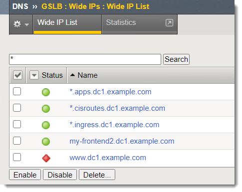
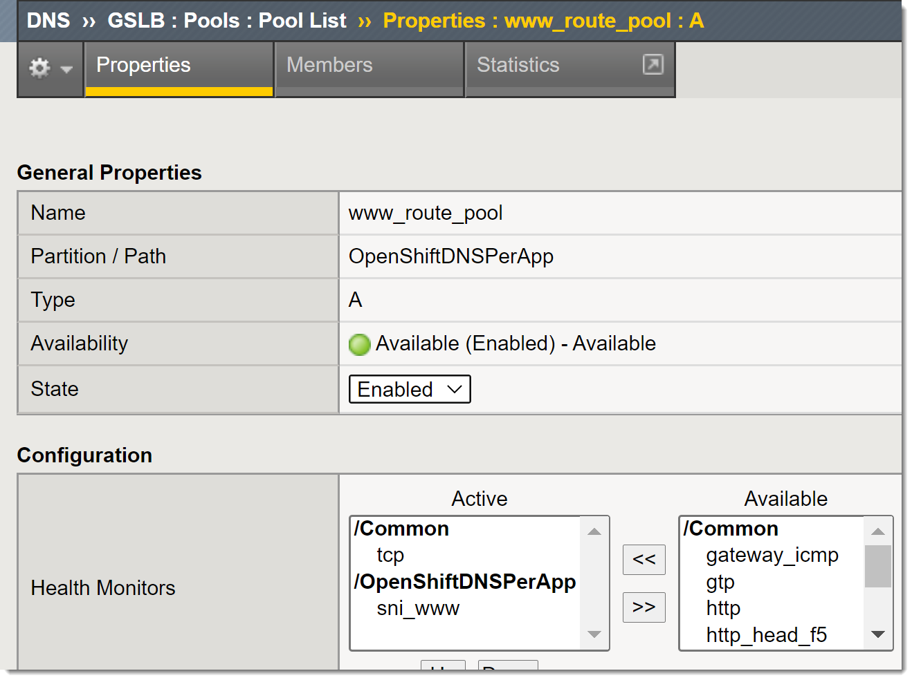
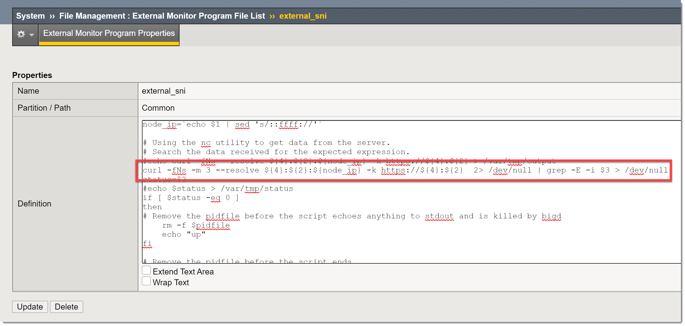

BIG-IP DNS
==========

Introduction
~~~~~~~~~~~~

In this demo environment we have deployed some examples of using BIG-IP DNS with OpenShift.  These include:

* Wildcard DNS for *.apps.[base domain]
* Individual DNS for [specific app].apps.[base domain]
* Caching/Static DNS resolver to support OpenShift DNS infrastructure requirements

Demo
~~~~

Start by selecting the "OpenShiftDNS" partition on the BIG-IP.  Take a look at the Wide-IPs that were created.

Note that we have created several DNS records to support this lab environment.

Next change to the "OpenShiftDNSPerApp"

Drill down to the DNS pool "www_route_pool".  This is an example of where BIG-IP DNS is monitoring the 
OpenShift Router directly.  Note that an external monitor is being used.  In this scenario we are emulating
a situation where you are monitoring a service that is using a "passthrough" OpenShift route.  When "passthrough" 
is enabled it requires that BIG-IP DNS use ServerName Indication (SNI) when sending health checks to the OpenShift 
Router.

