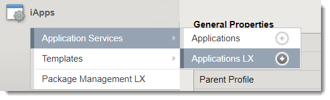
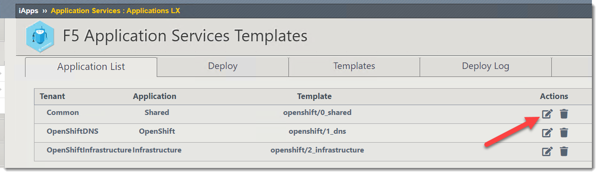
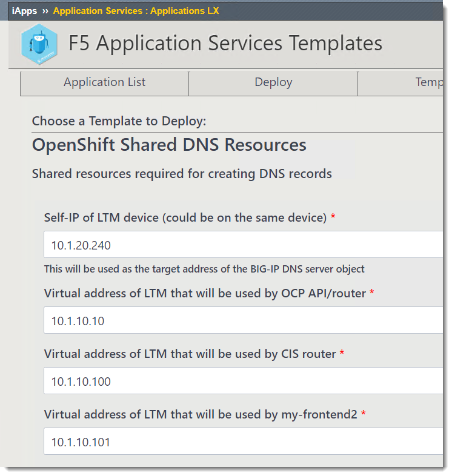
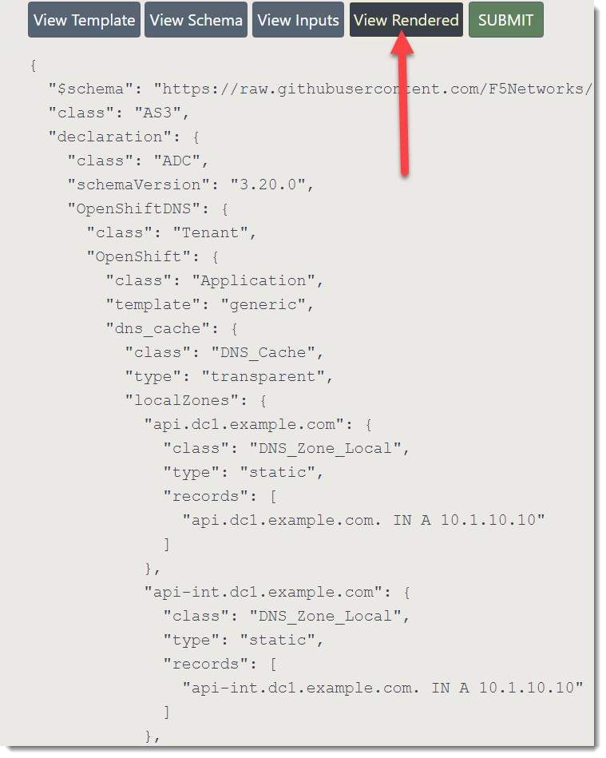
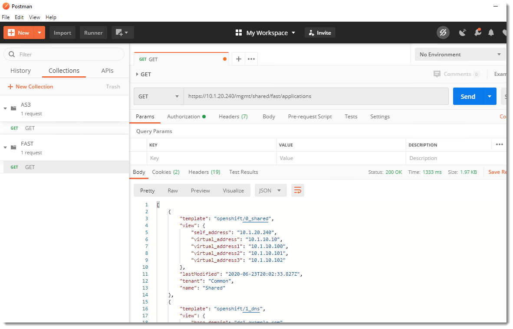
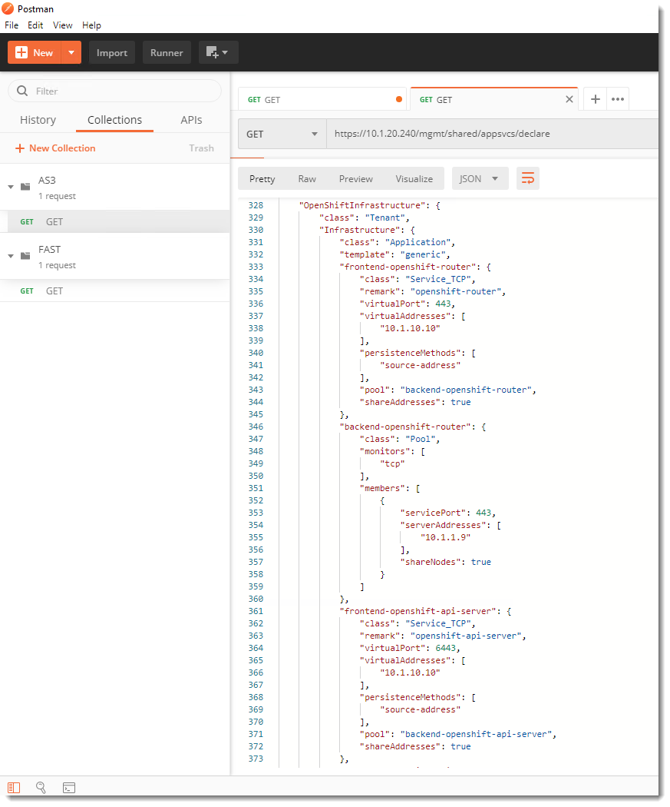
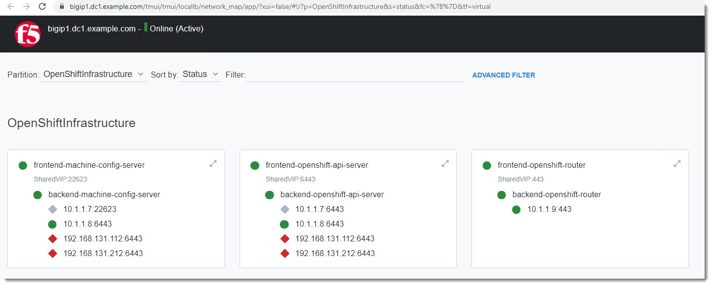

F5 Application Services Template (FAST)
=======================================

Introduction
~~~~~~~~~~~~

FAST is being used to templatize the deployment.

Demo
~~~~

You can view fast under iApps -> Applications LX 

Next click on "F5 Application Services Templates"

You will see a basic auth prompt.  Login using admin/admin.

The first page will show a list of the applications that have been deployed using fast.

Click on the first one.

This represents the first set of configurations used for OpenShift.  They consist of "Shared" resources that 
are deployed in the Common partition.  Some of the objects are:

- DNS Data Center
- DNS Server
- DNS Virtual Server
- Shared Virtual Addresses

The next set of resources are for provisioning DNS resources.  These are created in the partition OpenShiftDNS.

You can view the AS3 declaration that will be used to generate the DNS resources by clicking on "View Rendered".

Open up Postman and run the "GET" request under the Fast collection.

Note that the output is succint (short).

Now run the "GET" request under the AS3 collection.  It is very verbose!

Compare this to the configuration on the BIG-IP.  FAST made it fast to deploy.  [slow clap].

  