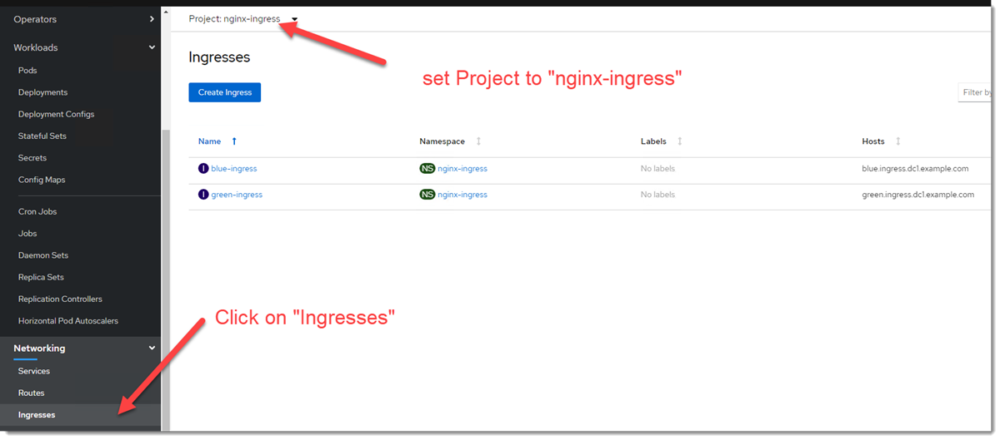
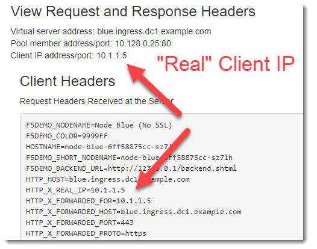

NGINX Ingress Controller for OpenShift
======================================

Introduction
~~~~~~~~~~~~

NGINX Ingress Controller has been configured in the namespace "nginx-ingress".

There is an example of using an Ingress resource.

NGINX is using the BIG-IP as the edge load balancer.

NGINX is also using "proxy protocol" to preserve the source IP address of the connection.

Restarting NGINX
~~~~~~~~~~~~~~~~

You may need to restart the NGINX Ingress Controller prior to your demo.  To restart the pod
you can either delete the pod via the GUI or run the following script from the "web" host.

.. code-block:: shell
    
    $ ~/restart-nginx.sh
    pod "my-nginx-ingress-controller-6bd7f89688-78z9l" deleted

Demo
~~~~

Start by changing the "Project" to "nginx-ingress" in the OpenShift Console and click on "Ingresses"
under "Networking".

If you click on the blue-ingress example you can click on YAML to see what the Ingress resource looks like.

.. code-block:: YAML
    
    apiVersion: extensions/v1beta1
    kind: Ingress
    metadata:
      name: blue-ingress
      annotations:
        kubernetes.io/ingress.class: "nginx"
        nginx.org/server-snippets: |
          add_header x-nginx-ingress $hostname;
        appprotect.f5.com/app-protect-policy: "nginx-ingress/basic-block"
        appprotect.f5.com/app-protect-enable: "True"
        appprotect.f5.com/app-protect-security-log-enable: "True"
        appprotect.f5.com/app-protect-security-log: "nginx-ingress/logconf"
        appprotect.f5.com/app-protect-security-log-destination: "syslog:server=10.1.1.4:514"
    spec:
      tls:
        - hosts:
          - blue.ingress.dc1.example.com
          # This assumes tls-secret exists and the SSL
          # certificate contains a CN for foo.bar.com
          secretName: tls-secret
      rules:
      - host: blue.ingress.dc1.example.com
        http:
          paths:
          - backend:
              serviceName: node-blue
              servicePort: 80

In this example NGINX is performing TLS termination of the connection and SSL offload.

You can also see that it is configured to use NGINX App Protect as well.

Next click on ConfigMaps under Workloads.  Find the "my-nginx-ingress-controller" resource.

.. code-block:: YAML

    data:
    proxy-protocol: 'True'
    real-ip-header: proxy_protocol
    set-real-ip-from: 10.130.0.0/23

Note that NGINX is configured to use "proxy_protocol".  This enables a TCP connection to embed the original Client
IP address at the beginning of a connection (without the need to use X-Forwarded-For or a mechanism that requires L7 
visibility).

In this example we are enabling "proxy_protocol" for connections from the BIG-IP.  In the previous ConfigMaps section
you may have noticed that an iRule is being used to insert the "proxy_protocol" information.

.. code-block:: TCL

    when CLIENT_ACCEPTED {
        set proxyheader "PROXY TCP[IP::version] [IP::remote_addr] [IP::local_addr] [TCP::remote_port] [TCP::local_port]\r\n"
    }
    
    when SERVER_CONNECTED {
        TCP::respond $proxyheader
    }

This can be seen when connecting to https://blue.ingress.dc1.example.com

Take note that the original client IP address is visible despite the BIG-IP only performing TCP
load balancing to the NGINX Ingress Controller.

The resource is using a certificate that is loaded on NGINX, but NGINX is able to insert the 
proper XFF because the BIG-IP is providing the original client IP address via proxy protocol.

You can also verify that NGINX App Protect is running by sending the following curl command
from the web host.

.. code-block:: shell
  
  $ curl https://blue.ingress.dc1.example.com -H "X-Hacker: cat /etc/passwd"

You can grep /var/log/messages on the web host to see the syslog output from NAP.

.. code-block:: shell
  
  $ sudo grep "ASM: " /var/log/messages
  ...
  Aug  6 20:29:02 my-nginx-ingress-controller-7fc9646655-jjlmg ASM: attack_type="Non-browser Client,Predictable Resource Location,Command Execution",blocking_exception_reason="N/A",date_time="2020-08-06 20:29:01",dest_port="443",ip_client="10.1.1.4",is_truncated="false",method="GET",policy_name="basic-block",protocol="HTTPS",request_status="blocked",response_code="0",severity="Critical",sig_cves="N/A",sig_ids="200003898,200003910",sig_names="""cat"" execution attempt (2) (Header),""/etc/passwd"" access (Header)",sig_set_names="{Command Execution Signatures;OS Command Injection Signatures},{Predictable Resource Location Signatures}",src_port="47212",sub_violations="N/A",support_id="7555337960057516705",threat_campaign_names="N/A",unit_hostname="N/A",uri="/",violation_rating="4",vs_name="13-blue.ingress.dc1.example.com:8-/",x_forwarded_for_header_value="N/A",outcome="REJECTED",outcome_reason="SECURITY_WAF_VIOLATION",violations="Attack signature detected,Violation Rating Threat detected",violation_details="<?xml version='1.0' encoding='UTF-8'?><BAD_MSG><violation_masks><block>10000000000c00-3030cc0000000</block><alarm>477f0ed09200fa8-8003434cc0000000</alarm><learn>0-0</learn><staging>0-0</staging></violation_masks><request-violations><violation><viol_index>42</viol_index><viol_name>VIOL_ATTACK_SIGNATURE</viol_name><context>header</context><header><header_name>WC1IYWNrZXI=</header_name><header_value>Y2F0IC9ldGMvcGFzc3dk</header_value><header_pattern>*</header_pattern><staging>0</staging></header><staging>0</staging><sig_data><sig_id>200003898</sig_id><blocking_mask>2</blocking_mask><kw_data><buffer>LjYxLjENCkFjY2VwdDogKi8qDQpYLUhhY2tlcjogY2F0IC9ldGMvcGFzc3dkDQoNCg==</buffer><offset>28</offset><length>8</length></kw_data></sig_data><sig_data><sig_id>200003910</sig_id><blocking_mask>2</blocking_mask><kw_data><buffer>QWNjZXB0OiAqLyoNClgtSGFja2VyOiBjYXQgL2V0Yy9wYXNzd2QNCg0K</buffer><offset>27</offset><length>11</length></kw_data></sig_data></violation></request-violations></BAD_MSG>",request="GET / HTTP/1.1\r\nHost: blue.ingress.dc1.example.com\r\nUser-Agent: curl/7.61.1\r\nAccept: */*\r\nX-Hacker: cat /etc/passwd\r\n\r\n"#015 
