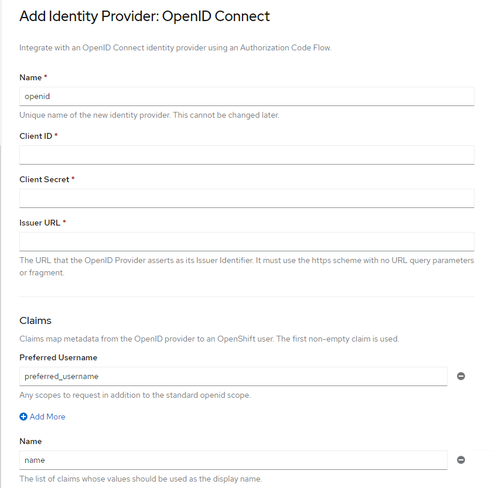
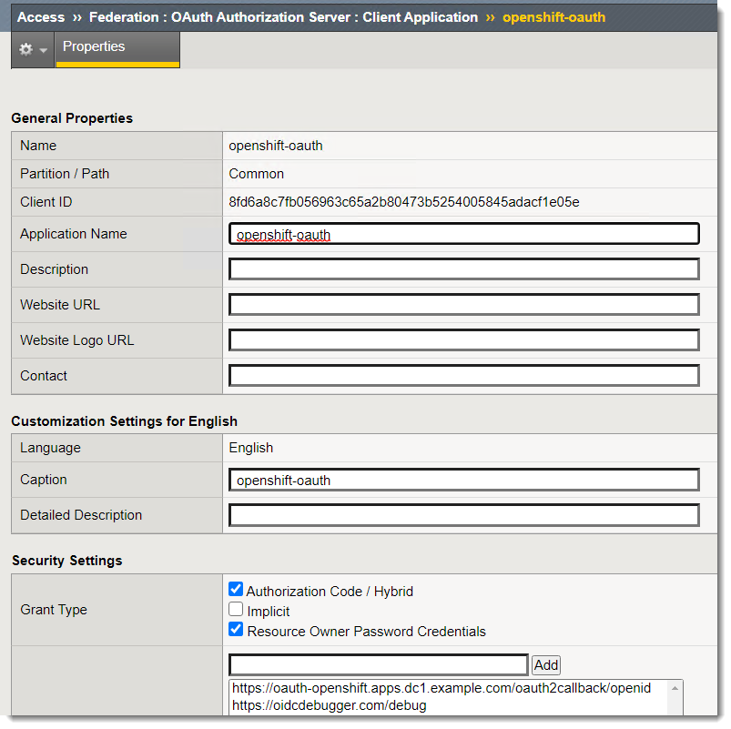
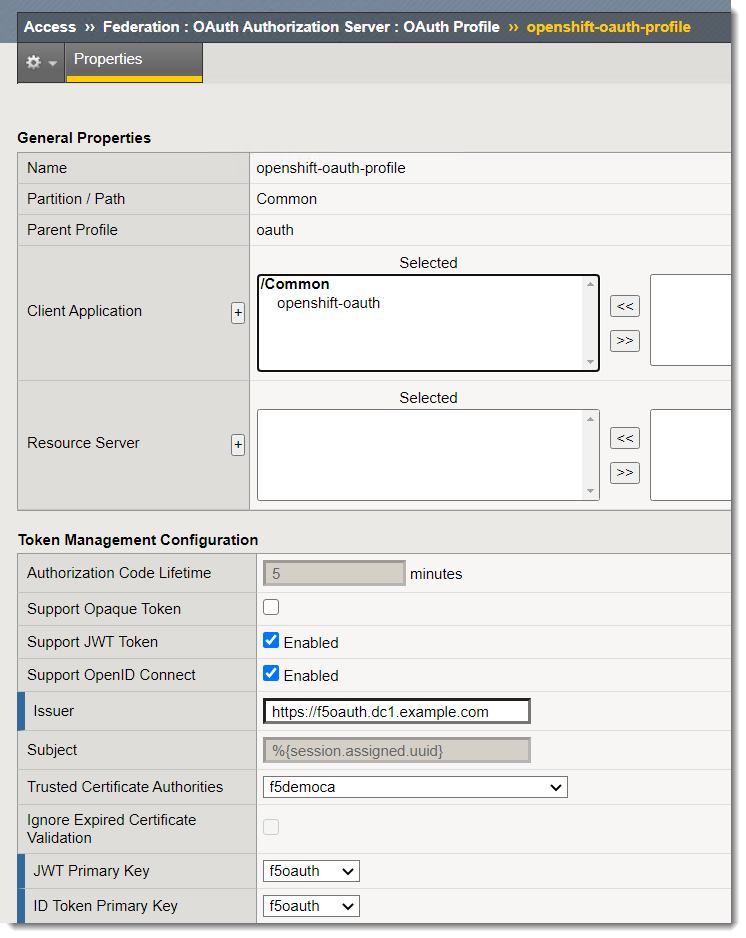

OpenID Connect
==============

Introduction
~~~~~~~~~~~~

OIDC is being used to authenticate the OpenShift Console.

The configuration is in the partition OpenShiftAuth.

Demo
~~~~

In the OpenShift Console go to Cluster Settings -> Global Configurations -> OAuth

If you click on YAML you will see the existing configuration.

.. code-block:: YAML

    spec:
    identityProviders:
        - mappingMethod: claim
        name: openid
        openID:
            ca:
            name: openid-ca-gxfzz
            claims:
            email: []
            name: []
            preferredUsername:
                - sub
            clientID: 8fd6a8c7fb056963c65a2b80473b5254005845adacf1e05e
            clientSecret:
            name: openid-client-secret-l4jkv
            extraScopes: []
            issuer: 'https://f5oauth.dc1.example.com/f5-oauth2/v1'
        type: OpenID

Click on "Add" and "OIDC" and you will see how this config was populated.

On the BIG-IP under the Common partition click on Access -> Federation -> OAuth Authorization Server -> Client Application

Next click on the profile (should be on the previous screen where you clicked on the application).

The OpenShift Console is using this BIG-IP configuration to authenticate.