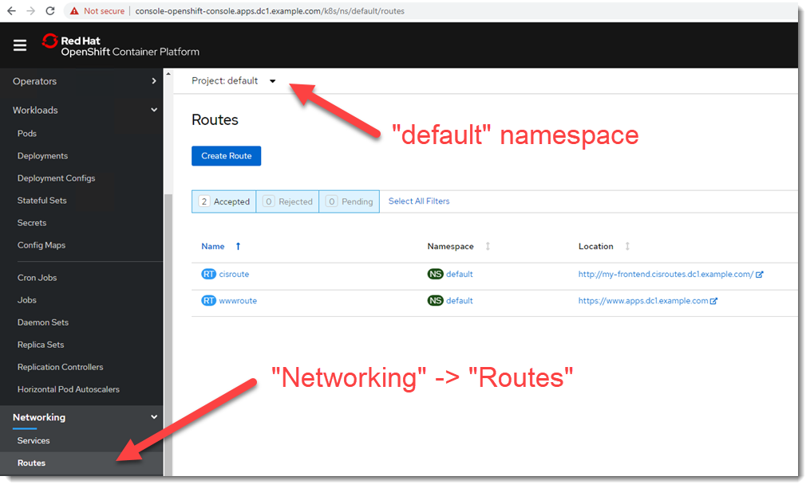
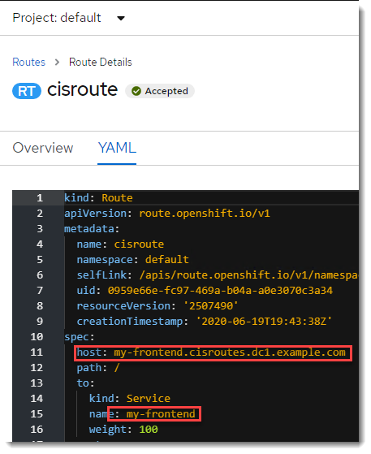
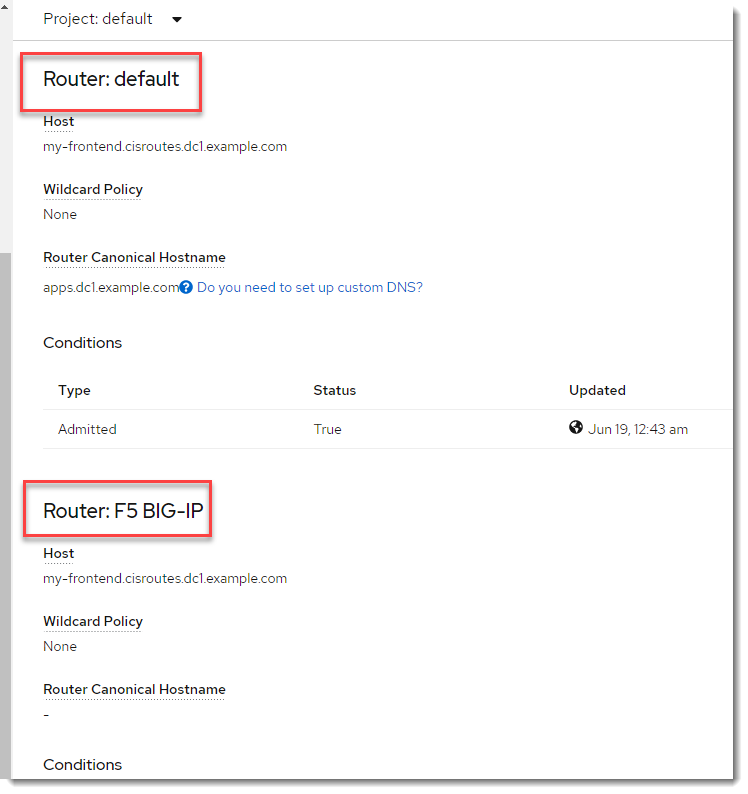
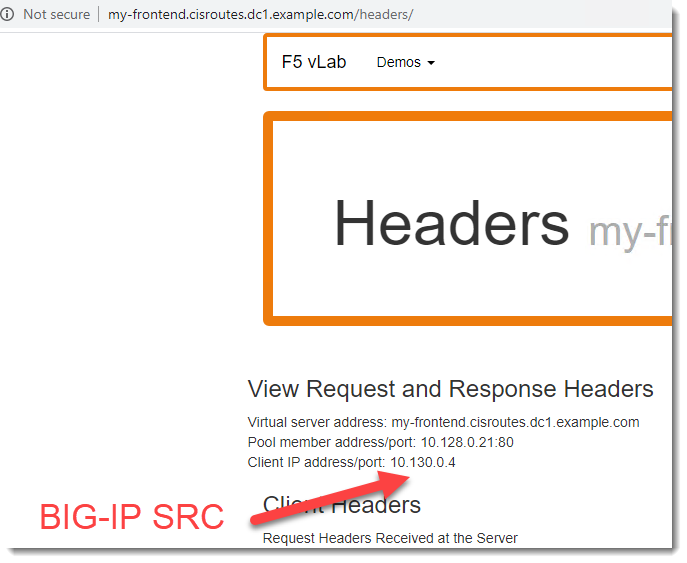
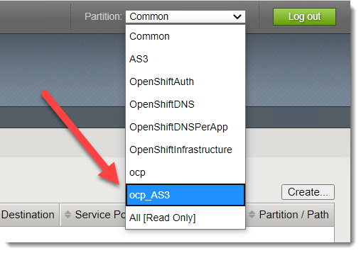
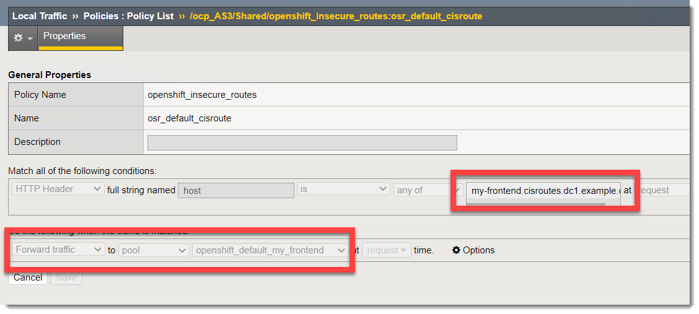

OpenShift Routes
================

Introduction
~~~~~~~~~~~~

Container Ingress Services can be used to deploy a OpenShift Route.  This can be used either as an
auxilary to the OpenShift Router or a replacement.  The following will walk through looking at 
the Route resource in the OpenShift Console and comparing it to the generated configuration on the BIG-IP.

Demo
~~~~

Under the "default" namespace expand "Networking" and click on "Routes".  You should see the following 
two routes.

These routes have been deployed on the BIG-IP.  We will look closer at the "cisroute" by clicking on it.

After clicking on the "YAML" tab you should see the route itself.  Take note of the host name and service.

Go back to the previous "Overview" page.  Scroll down and take note that the route status is both using the
"default" OCP router and "F5 BIG-IP".

Click on the route `http://my-frontend.cisroutes.dc1.example.com <http://my-frontend.cisroutes.dc1.example.com>`_

Observe the source IP address of the connection.

Click on the BIG-IP bookmark and look at the Local Traffic Policy for the route.

Login using the username "admin" and password "admin".

You will need to select the partition "ocp_AS3" from the top right.

Inspect the Local Traffic Policy that is being used for the route.  

`Local Traffic Manager -> Policies -> openshift_insecure_routes -> osr_default_cisroutes`

This matches the route that you saw earlier.

