Deploying Container Ingress Services
====================================

In the previous step we deployed applications, next we will deploy 
Container Ingress Services to automate provisioning OpenShift Routes
on the BIG-IP.

Adding the BIG-IP to the OpenShift Network
------------------------------------------

Before you can install CIS you need to make the BIG-IP part of the 
OpenShift network.  This can be achieved by adding a HostSubnet resource.

Here is the resource:

.. code-block:: YAML

    apiVersion: v1
    kind: HostSubnet
    metadata:
    name: bigip1
    annotations:
        pod.network.openshift.io/fixed-vnid-host: "0"
        pod.network.openshift.io/assign-subnet: "true"
    # provide a name for the BIG-IP device's host Node
    host: bigip1
    # Provide an IP address to serve as the BIG-IP VTEP in the OpenShift SDN
    hostIP: 10.1.20.240

The hostIP refers to the self-ip of the BIG-IP.

From the `~/f5-k8s-demo/ocp4` directory on the BIG-IP you can deploy
this resource by running the following command.

.. code-block:: shell

  $ oc create -f host.yaml

One you run that command you can run the following command to see the BIG-IP
has been added.

.. code-block:: shell

  $ oc get hostsubnet

You will get output that looks similar to the following.  Take note of the 
subnet that has been assigned to the BIG-IP.  You will need to use that 
information in the next step.

.. code-block:: text

    NAME                       HOST                       HOST IP       SUBNET          EGRESS CIDRS   EGRESS IPS
    bigip1                     bigip1                     10.1.20.240   10.130.0.0/23
    master.dc1.example.com     master.dc1.example.com     10.1.1.8      10.129.0.0/23
    worker-0.dc1.example.com   worker-0.dc1.example.com   10.1.1.9      10.128.0.0/23

Creating VXLAN Connection to OpenShift from BIG-IP
---------------------------------------------------

OpenShift is now able to send traffic to the BIG-IP, but the BIG-IP is not
configured to receive or send traffic to OpenShift.

Login to the BIG-IP using Putty.  There should be a profile for "bigip1".

Once connected you can run the following TMSH commands.

.. warning:: Use the subnet that matches your environment.  Also change the subnet from /23 to /14.

.. code-block:: text

    create /auth partition ocp
    create net tunnels vxlan ose-vxlan flooding-type multipoint
    create net tunnels tunnel openshift_vxlan key 0 profile ose-vxlan local-address 10.1.20.240
    # warning change subnet value to match output from oc get hostsubnet
    # the value may be different in your environment
    create net self vxlan-local address 10.130.0.3/14 allow-service none vlan openshift_vxlan
    create net self vxlan-float address 10.130.0.4/14 allow-service none vlan openshift_vxlan traffic-group traffic-group-1

The partition will be used by CIS to store networking information (fdb).

The tunnel type is VXLAN and is using a key of "0" to be able to access
all OpenShift networks.

At this point the BIG-IP has a VXLAN configuration.  The final networking
piece will be to install Container Ingress Services to add the necessary
fdb entries to allow the BIG-IP to send traffic to the correct OpenShift
nodes.

Operator Hub
------------

OpenShift uses "operators" to organize software into re-usable components.

Container Ingress Services can be deployed using an OpenShift operator.

CIS makes use of a "helm" operator to templatize the steps necessary to
have the proper RBAC, deployment.

.. tip:: 
   You can access the OpenShift console from Google Chrome.  Login using "openid" with username: admin, password: admin

Find the "Operator Hub" in the Console and search for "f5".

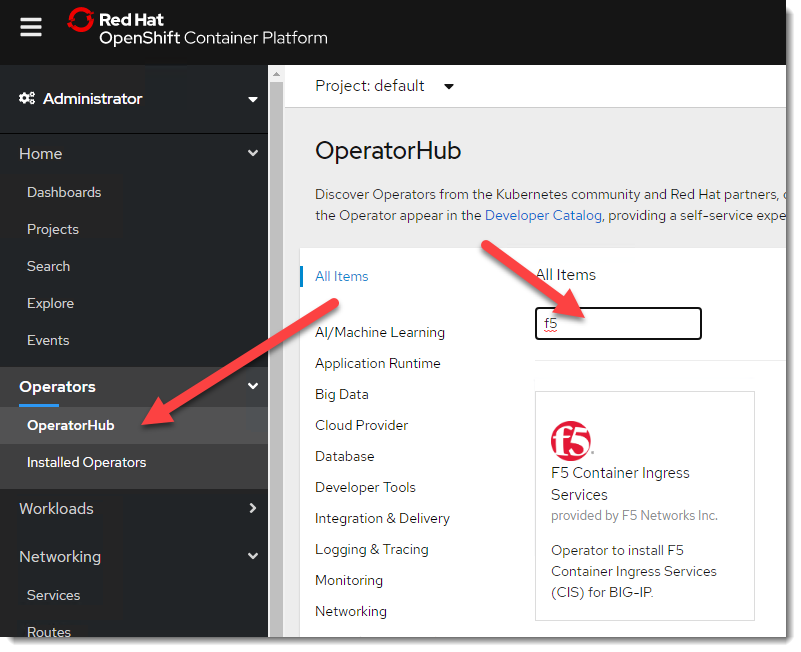

Next click on Install.

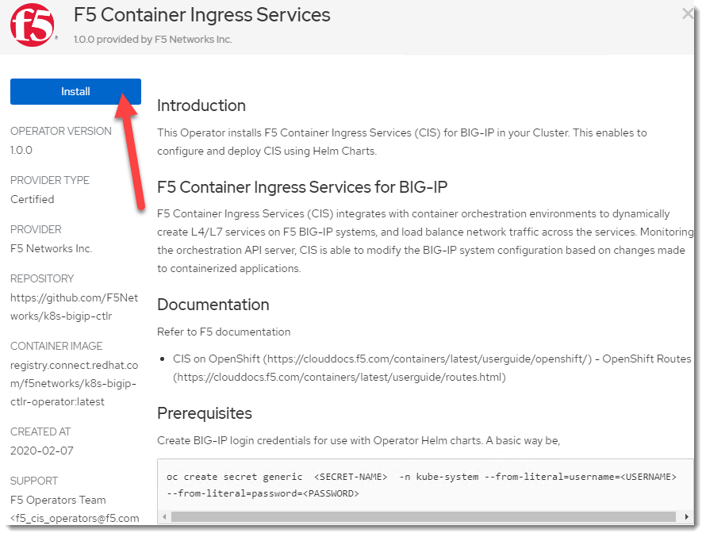

You will then want to create a subscription.  Select the "default" namespace.

.. note:: The controller will deploy in the "kube-system" regardless of the namespace of the operator.

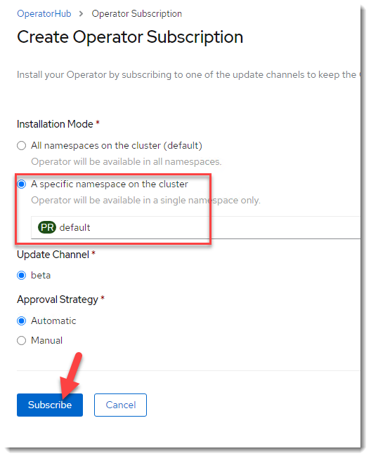

At this point you have enabled OpenShift to deploy an operator for 
Container Ingress Services.  As noted on the install screen you will 
need to create a "secret" that has the username and password that you
will access the BIG-IP.  The credentials must have "admin" privileges 
on the BIG-IP.  You can use the directions outlined on the page (using 
the "oc" command) or via the Console by changing to the "kube-system"
project and creating a "secret" under the "Workload" menu.

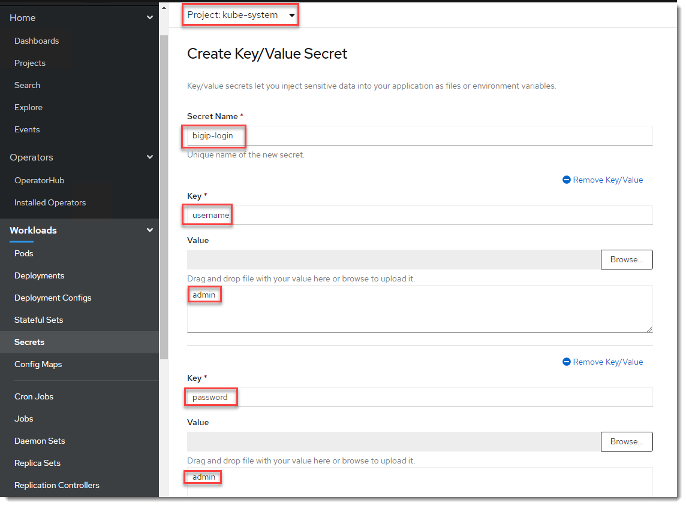

Next change back to the "default" project before proceeding.  

Go back to Operator Hub.

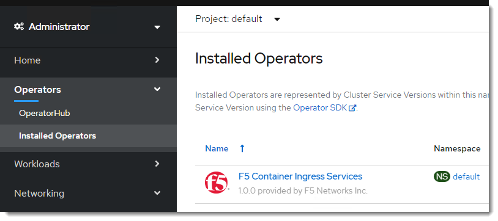

Click on CIS 

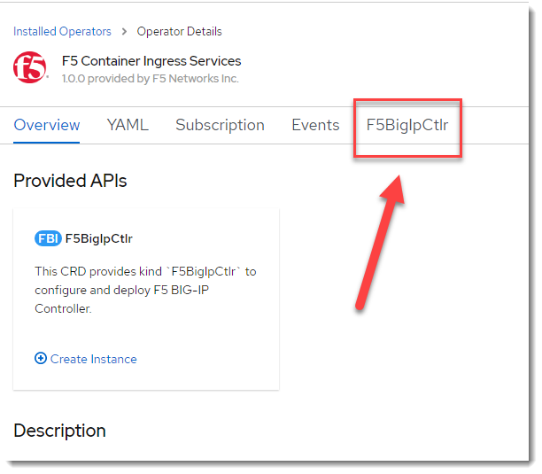

Click on "Create F5BigIpCtrl"

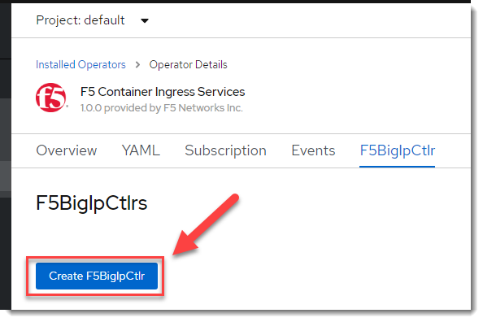

The inputs are taken from the CIS helm chart: https://github.com/F5Networks/charts/tree/master/src/stable/f5-bigip-ctlr

The following is what you should use.

.. code-block:: 

    apiVersion: cis.f5.com/v1
    kind: F5BigIpCtlr
    metadata:
    name: f5-server
    namespace: default
    spec:
    args:
        log_as3_response: true
        manage_routes: true
        manage_ingress: true
        manage_configmaps: true
        agent: as3
        log_level: INFO
        route_vserver_addr: 10.1.10.100
        bigip_partition: ocp
        openshift_sdn_name: /Common/openshift_vxlan
        bigip_url:  10.1.20.240
        insecure: true
        pool-member-type: cluster
        namespace: default
        override-as3-declaration: default/f5-as3-override
    bigip_login_secret: bigip-login
    image:
        pullPolicy: IfNotPresent
        repo: k8s-bigip-ctlr
        user: f5networks
    namespace: kube-system
    rbac:
        create: true
    resources: {}
    serviceAccount:
        create: true
        name: null
    version:  2.0.0

The Pod
-------

Next change to the "kube-system" project and find the Pod "f5-server...".

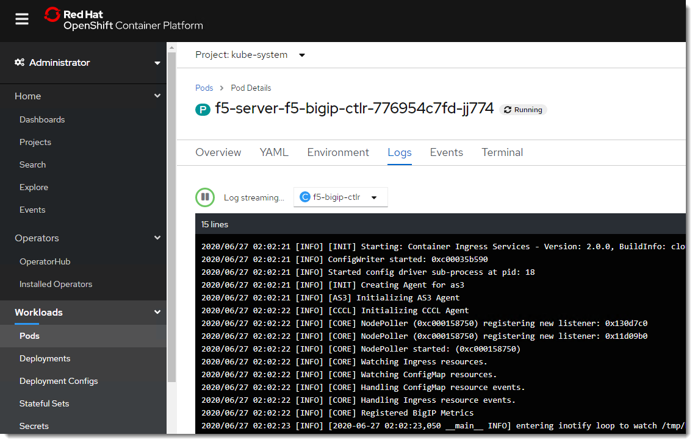

If you "DON'T" see something like that (like errors).  Then the easiest
fix is to restart the pod by 

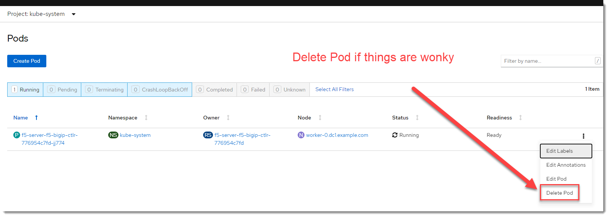

Deploy a Route
--------------

OpenShift makes use of "Routes" to provide L7 load balancing to applications.

We will next deploy the following Route.

.. code-block:: yaml

    apiVersion: route.openshift.io/v1
    kind: Route
    metadata:
    name: cisroute
    namespace: default
    spec:
    host: my-frontend.cisroutes.dc1.example.com
    path: /
    to:
        kind: Service
        name: my-frontend
    port:
        targetPort: 80

Under the "default" project go to Networking -> Routes.

Click on "create" then "Edit YAML" and enter the route from above.

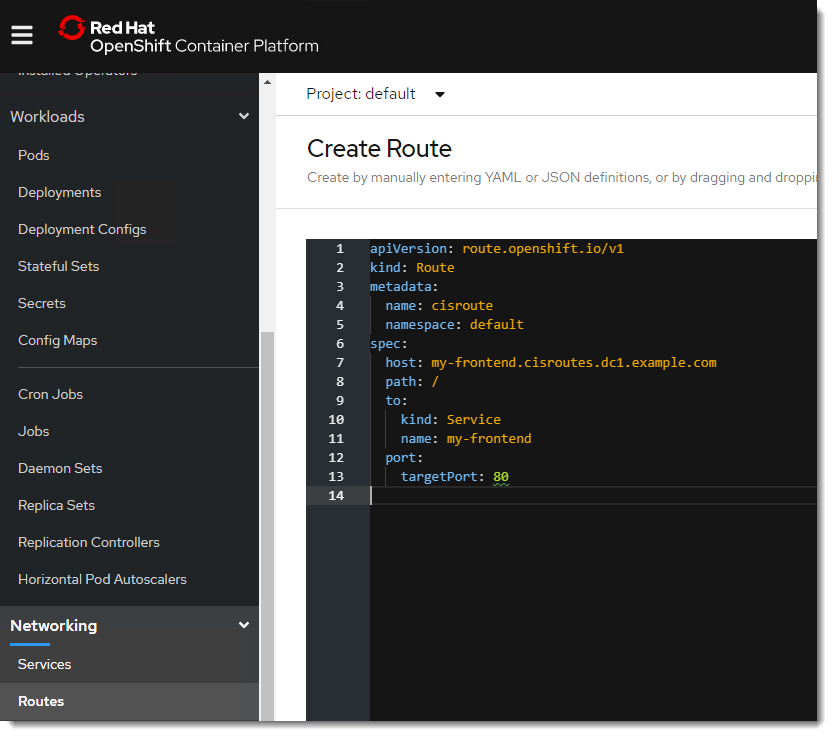

After clicking on create scroll down and observe the route appears on both
the "default" and "F5 BIG-IP".

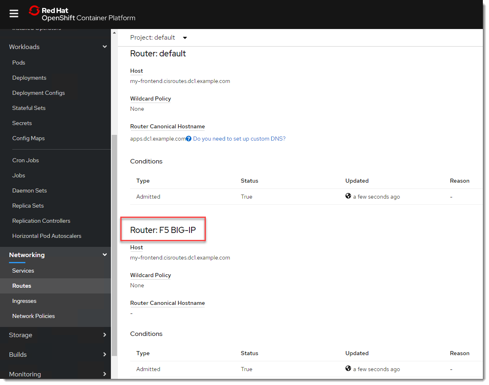

You should then be able to visit the deployed Route in Chrome (following 
steps from "Basic Demo").