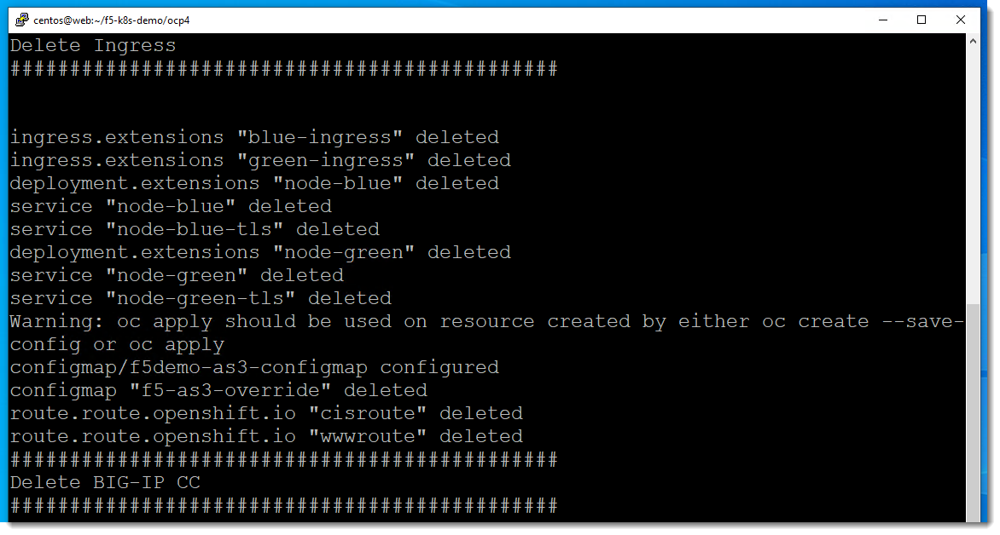

Resetting the environment
=========================

You will need to SSH to the "web" host to reset the environment.

On the Windows desktop you will want to click on the Putty icon.  You will
then select the "web" host and click on "open".

You will next want to change you directory to `/home/centos/f5-k8s-demo/ocp4`.
This directory is from the following GitHub repo: https://github.com/f5devcentral/f5-k8s-demo/tree/ocp4/ocp4

You will then run the command `teardown_demo.sh`.  This will RESET the environment.

.. code-block:: shell

  $ cd ~/f5-k8s-demo/ocp4
  $ ./teardown_demo.sh

It will take a few minutes to complete.

After it completes you will have an "empty" OpenShift environment and a "fresh"
BIG-IP that has not been configured to use Container Ingress Services.
